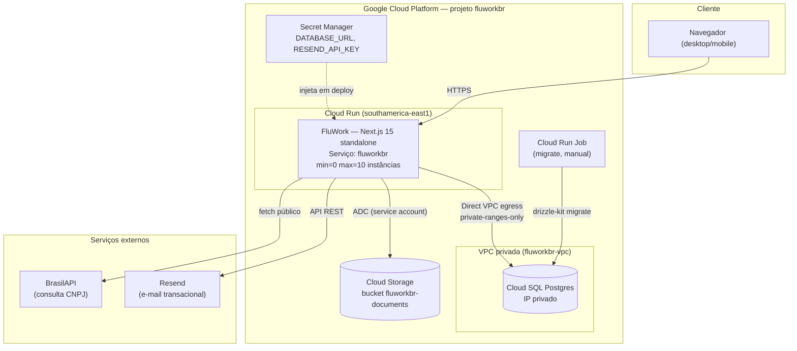
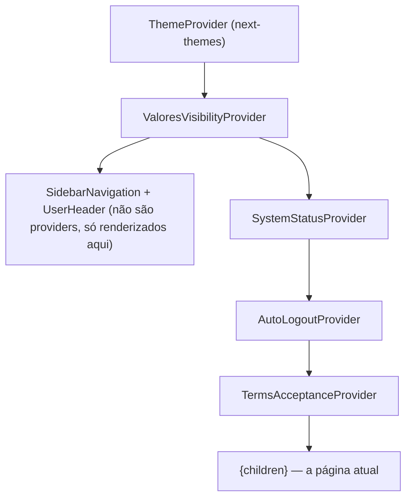
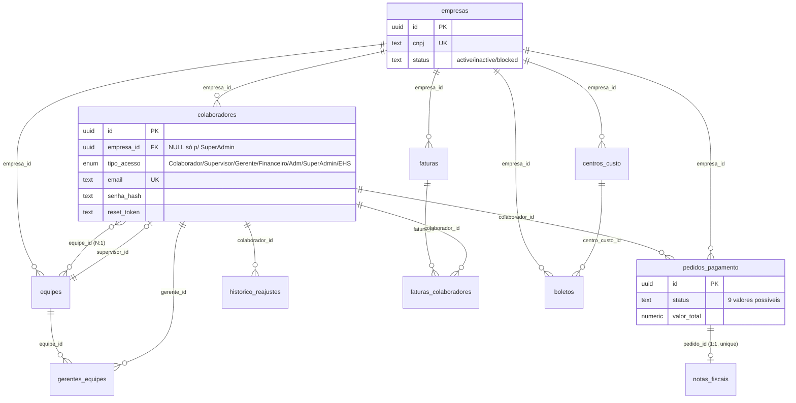
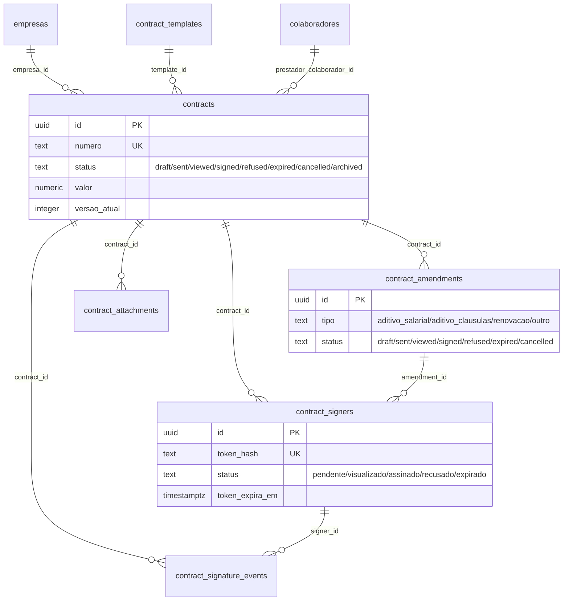
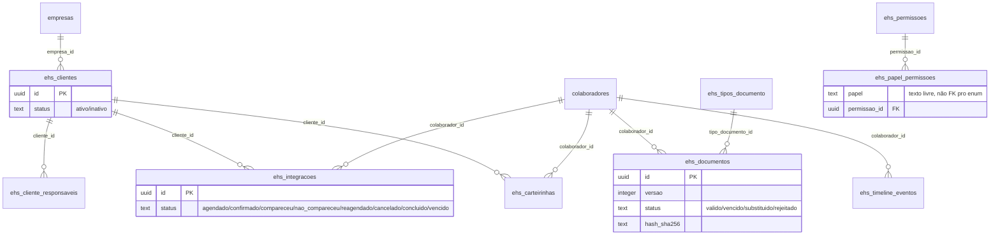
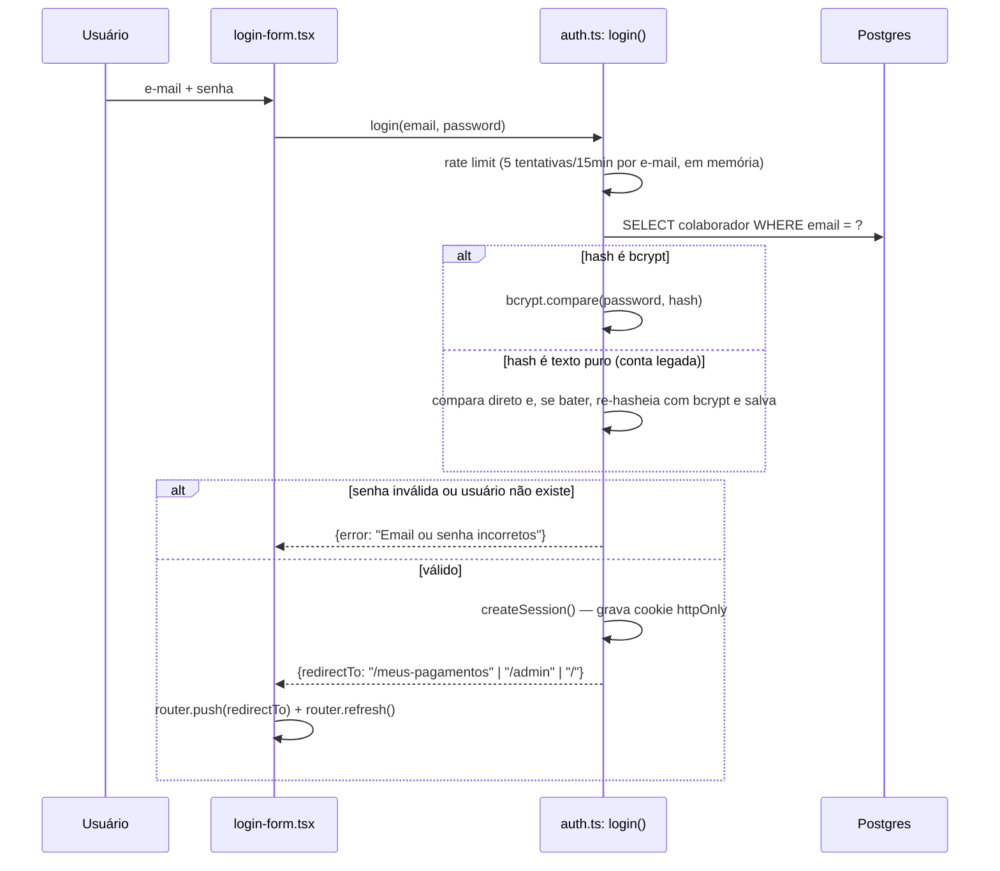
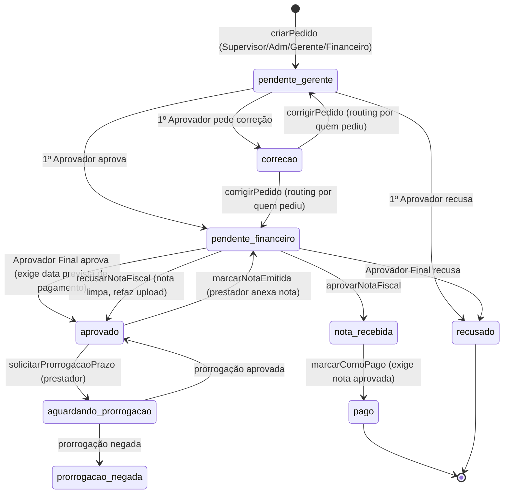
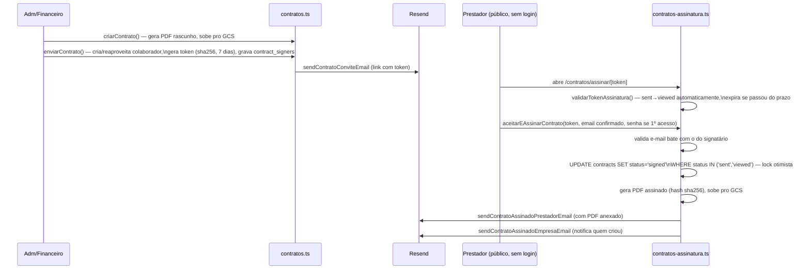
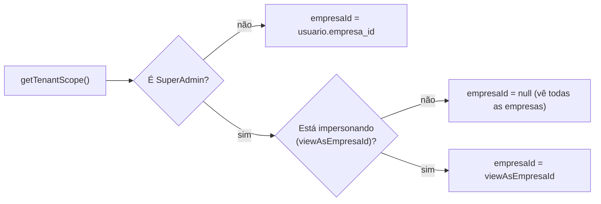
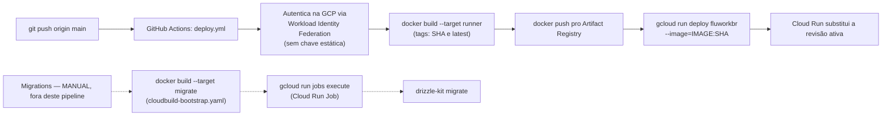

# FluWork — Documentação de Arquitetura

**Versão do documento:** 1.0 · **Data:** 2026-07-13 · **Baseado em:** estado real do código na branch `main` no momento da escrita.

> Este documento foi produzido por leitura direta do código-fonte (`app/`, `lib/`, `components/`, `middleware.ts`, `lib/db/schema.ts`, `Dockerfile`, `.github/workflows/`, `package.json`, migrations SQL). Onde uma informação não pôde ser confirmada no código, isso é dito explicitamente em vez de presumido. Seções de "Possíveis melhorias" são recomendações de quem escreveu este documento, não fatos sobre o sistema — estão sempre marcadas como tal.

## Sumário

1. [Visão Geral do Produto](#1-visão-geral-do-produto)
2. [Arquitetura Geral](#2-arquitetura-geral)
3. [Estrutura do Projeto](#3-estrutura-do-projeto)
4. [Arquitetura do Backend](#4-arquitetura-do-backend)
5. [Arquitetura do Frontend](#5-arquitetura-do-frontend)
6. [Banco de Dados](#6-banco-de-dados)
7. [Fluxos de Negócio](#7-fluxos-de-negócio)
8. [APIs](#8-apis)
9. [Autenticação e Autorização](#9-autenticação-e-autorização)
10. [Serviços Externos](#10-serviços-externos)
11. [Infraestrutura](#11-infraestrutura)
12. [Segurança](#12-segurança)
13. [Performance](#13-performance)
14. [Escalabilidade](#14-escalabilidade)
15. [Observabilidade](#15-observabilidade)
16. [Deploy](#16-deploy)
17. [Decisões Arquiteturais](#17-decisões-arquiteturais)
18. [Dívida Técnica](#18-dívida-técnica)
19. [Roadmap Técnico](#19-roadmap-técnico)
20. [Glossário Técnico](#20-glossário-técnico)

---

## 1. Visão Geral do Produto

### Objetivo da aplicação

FluWork é uma plataforma B2B SaaS multi-tenant para empresas que contratam prestadores de serviço PJ ("colaboradores" no vocabulário do sistema) gerenciarem todo o ciclo de vida financeiro e contratual dessa relação: lançamento e aprovação de ordens de pagamento, emissão e validação de notas fiscais, contratos com assinatura eletrônica, e — desde a adição mais recente — um módulo de compliance de Segurança do Trabalho (EHS) para empresas que também precisam controlar documentação (ASO, NRs, certificados) e agendamento de prestadores em clientes finais.

### Problema que resolve

Empresas que operam com uma base grande de prestadores PJ (terceirizados, freelancers, técnicos alocados em clientes) tipicamente coordenam esse fluxo por planilhas, e-mail e WhatsApp: quem lançou a ordem, quem aprovou, se a nota fiscal foi anexada, se o contrato foi assinado, se a documentação de segurança do trabalho está válida. FluWork substitui esse processo manual por um fluxo de aprovação em duas etapas com trilha de auditoria, contratos com assinatura eletrônica juridicamente rastreável, e (no módulo EHS) um painel de compliance que calcula automaticamente o que está vencido ou prestes a vencer.

### Público-alvo

- **Empresas contratantes** (o tenant) — o cliente pagante da FluWork. Usam os papéis `Adm`, `Financeiro`, `Gerente`, `Supervisor`, e opcionalmente `EHS`.
- **Prestadores PJ** (`Colaborador` no enum de papéis, rotulado "Prestador" na interface) — recebem pagamentos, assinam contratos, e no módulo EHS acompanham a própria documentação.
- **Equipe da FluWork** (`SuperAdmin`) — não pertence a nenhuma empresa; opera um painel administrativo cross-tenant e pode entrar em modo "visualizar como empresa" para suporte.

### Fluxos principais

1. **Ordem de pagamento**: Lançador de Ordem cria → 1º Aprovador aprova/recusa/pede correção → Aprovador Final aprova/recusa/pede correção → prestador anexa nota fiscal → Aprovador Final aprova a nota → pagamento.
2. **Contrato**: Adm/Financeiro cria um contrato → envia por e-mail com link de assinatura tokenizado → prestador confirma e-mail, define senha (se primeiro acesso) e assina eletronicamente → PDF assinado é gerado e enviado por e-mail a ambas as partes.
3. **EHS & Compliance**: equipe de compliance cadastra Clientes (empresas onde os prestadores trabalham) e Prestadores (o mesmo colaborador já cadastrado), agenda Integrações (visitas/liberações), acompanha documentos versionados (ASO, NRs, certificados) com Compliance Score calculado em tempo real, e emite Carteirinhas Digitais.
4. **Suporte multi-tenant**: SuperAdmin entra em "modo visualizar como empresa" para investigar um problema relatado por um cliente, navegando por todas as páginas daquela empresa em modo somente leitura.

---

## 2. Arquitetura Geral

### Diagrama da arquitetura



### O que existe

Uma aplicação Next.js 15 (App Router) monolítica, rodando como um único serviço no Cloud Run, servindo tanto as páginas (Server Components) quanto a "API" (majoritariamente Server Actions, não REST). Não há microsserviços, não há gateway de API separado, não há backend distinto do frontend — é um único processo Node.js servindo tudo.

### Como funciona — fluxo completo de uma requisição

```mermaid
sequenceDiagram
    participant B as Navegador
    participant MW as middleware.ts (edge)
    participant RSC as Server Component (page.tsx)
    participant SA as Server Action (app/actions/*.ts)
    participant Tenant as lib/tenant.ts
    participant DB as Drizzle ORM → Cloud SQL
    participant GCS as Google Cloud Storage
    participant Email as Resend

    B->>MW: GET /pedidos (cookie fluxopay_session)
    MW->>MW: parseia cookie, checa allowlist de papel\n(só Colaborador e EHS têm allowlist;\ndemais papéis passam livres aqui)
    MW-->>B: redireciona ou segue
    MW->>RSC: encaminha requisição (injeta x-pathname)
    RSC->>Tenant: getSession() / getTenantScope()
    RSC->>DB: SELECT ... WHERE empresa_id = (escopo do tenant)
    DB-->>RSC: linhas
    RSC-->>B: HTML renderizado no servidor + payload RSC

    Note over B,SA: Interação do usuário (ex: aprovar pedido)
    B->>SA: chamada de Server Action (POST, protegido por\nverificação de Origin do próprio Next.js)
    SA->>SA: checagem de papel/permissão (manual ou\nexigirPermissaoEhs/checkPermission)
    SA->>DB: UPDATE ... (mutação)
    SA->>GCS: upload de arquivo (quando aplicável)
    SA->>Email: envio de e-mail transacional (best-effort)
    SA-->>B: {success, error?} ou redirect
    B->>B: router.refresh() — busca nova árvore RSC
```

### Frontend

Next.js 15 App Router com React 19, renderizado majoritariamente no servidor (62 rotas `page.tsx`, apenas 1 com `"use client"` no nível da página). Não existe uma "SPA" separada — o roteamento é feito pelo próprio App Router, e a maior parte dos dados chega já resolvida no HTML/payload RSC gerado no servidor. Client Components (marcados `"use client"`) existem nos níveis de folha (formulários, diálogos, listas interativas) para lidar com estado local e chamadas de Server Actions. Ver Capítulo 5 para detalhes.

### Backend

Não há uma camada de API REST convencional para a lógica de negócio. O "backend" é, na prática, os 29 arquivos em `app/actions/*.ts` — Server Actions do Next.js, funções assíncronas que rodam exclusivamente no servidor e são chamadas diretamente de Client Components como se fossem funções locais (o Next.js gera o endpoint HTTP e a serialização por baixo dos panos). Existem apenas 6 rotas REST reais (`app/api/**/route.ts`), usadas para o que Server Actions não resolvem bem: servir arquivos binários (PDF, imagens), e dois uploads legados. Ver Capítulo 4 e Capítulo 8.

### Banco de dados

PostgreSQL rodando em Cloud SQL, acessado exclusivamente por IP privado (nunca exposto publicamente), via Drizzle ORM (`drizzle-orm` + driver `pg`/node-postgres, não `postgres.js`). 30 tabelas, schema definido em código TypeScript (`lib/db/schema.ts`, 897 linhas) com migrations geradas por `drizzle-kit`. Ver Capítulo 6.

### Serviços externos

Google Cloud Storage (armazenamento de arquivos), Resend (e-mail transacional), BrasilAPI (consulta pública de CNPJ, sem chave). Nenhum gateway de pagamento, SMS, ou serviço de analytics foi encontrado no código. Ver Capítulo 10.

### Infraestrutura

Google Cloud Platform, projeto `fluworkbr`, região `southamerica-east1`. Cloud Run para o serviço da aplicação (autoscaling 0–10 instâncias), Cloud SQL para Postgres, Cloud Storage para arquivos, Secret Manager para credenciais, GitHub Actions para CI/CD com autenticação via Workload Identity Federation (sem chaves estáticas). Ver Capítulo 11 e 16.

### Por que foi implementada dessa forma

O uso de Server Actions em vez de uma API REST tradicional é a decisão arquitetural mais estrutural do projeto: elimina a necessidade de definir contratos de API, serialização manual, e um cliente HTTP separado — o Next.js cuida disso. O trade-off (discutido no Capítulo 17) é que não existe uma "API pública" documentável no sentido tradicional: os 29 arquivos de Server Actions *são* a API, mas só são chamáveis de dentro da própria aplicação Next.js, não por um cliente externo (mobile app nativo, integração de terceiros) sem reescrita.

### Limitações conhecidas

- Aplicação monolítica: um único ponto de deploy, um único processo escalando horizontalmente — não há como escalar módulos (ex: EHS) independentemente do resto.
- Sem camada de API pública/versionada — qualquer integração externa futura exigiria construir rotas REST novas do zero.
- Sem cache distribuído (Redis) — cada requisição que precisa de dados vai ao Postgres.

### Possíveis melhorias

- Se houver necessidade futura de um app mobile nativo ou integração de terceiros, uma camada de API REST/GraphQL versionada precisaria ser construída ao lado das Server Actions (não substituindo-as, já que o frontend web continua se beneficiando do modelo atual).
- Introduzir um cache (Redis/Memorystore) para consultas de leitura repetidas (ex: contagem de pendências no header, que hoje faz round-trip ao banco a cada 30s por usuário conectado — ver Capítulo 13).

---

## 3. Estrutura do Projeto

### Organização das pastas (nível raiz)

```
app/                    # Next.js App Router — páginas, Server Actions, rotas REST
  actions/              # 29 arquivos de Server Actions — a "API" da aplicação
  api/                  # 6 rotas REST reais (arquivos, uploads, error reporting)
  admin/                # Painel SuperAdmin (/admin/*)
  ehs/                  # Módulo EHS & Compliance (/ehs/*)
  [demais pastas]       # Uma pasta por rota de página (App Router convention)
components/             # Componentes React
  ui/                   # 57 primitivas shadcn/ui (button, dialog, table...)
  ehs/                  # 18 componentes específicos do módulo EHS
  contratos/            # 9 componentes do módulo de Contratos
  admin/                # 8 componentes do painel SuperAdmin
  landing/              # Landing page pública (sections/ + ui/ próprios)
  auth/                 # Formulários de login/recuperação de senha
  brand/                # Logo e identidade visual
  [59 arquivos soltos]  # Componentes de domínio não organizados em subpasta
    (pedidos, aprovações, financeiro, notas, colaboradores, equipes)
contexts/               # 1 Context React (ValoresVisibilityContext)
hooks/                  # 2 hooks customizados (auto-logout, useIsMobile)
lib/                    # Lógica de domínio, acesso a dados, utilitários
  db/                   # schema.ts, migrations/, index.ts (conexão)
  admin/                # Registro genérico de tabelas (Espelho de Dados)
  ehs/                  # Regras de negócio do módulo EHS (compliance, validade, RBAC)
  contracts/            # Token de assinatura, montagem de dados p/ PDF
  pdf/                  # Templates @react-pdf/renderer
  email.ts              # Todos os templates/envios de e-mail transacional
  session.ts            # Cookie de sessão
  auth-utils.ts          # getUsuarioLogado()
  tenant.ts              # Isolamento multi-tenant (getTenantScope, assertSameCompany...)
  nav-config.ts          # Fonte única da navegação (sidebar + command palette)
  gcs.ts                 # Cliente do Google Cloud Storage
lib/db/migrations/      # 15 migrations SQL numeradas (0000–0014), geradas por drizzle-kit
scripts/                # ~55 arquivos SQL legados (era Supabase, ver Capítulo 18)
middleware.ts           # Edge middleware — allowlist de rotas por papel
Dockerfile              # Build multi-stage (base/deps/builder/runner/migrate)
.github/workflows/      # CI/CD (deploy.yml)
```

### Responsabilidade de cada diretório

| Diretório | Responsabilidade |
|---|---|
| `app/<rota>/page.tsx` | Um Server Component por rota — busca dados via Drizzle diretamente ou chama uma Server Action de leitura, e renderiza. |
| `app/actions/*.ts` | Toda a lógica de mutação e a maior parte da lógica de leitura. Cada arquivo agrupa um domínio (pedidos, contratos, colaboradores...). |
| `lib/db/schema.ts` | Única fonte de verdade do modelo de dados — tabelas, relations, enums, constraints. |
| `lib/*.ts` (raiz de `lib/`) | Utilitários e regras de domínio compartilhadas entre múltiplas Server Actions/páginas — não são componentes React nem rotas. |
| `components/ui/` | Camada de design system (shadcn/ui) — sem lógica de negócio, reutilizável em qualquer contexto. |
| `components/<domínio>/` | Componentes acoplados a um domínio específico (ehs, contratos, admin) — podem chamar Server Actions daquele domínio. |
| `components/` (raiz) | Componentes de domínio que não foram organizados em subpasta — inclui a maioria dos componentes de pedidos/financeiro/cadastros, criados antes da convenção de subpastas por módulo (ver Capítulo 18). |

### Convenções utilizadas

- **Nomenclatura**: variáveis, funções e comentários majoritariamente em português; nomes de colunas/tabelas do banco em `snake_case`, propriedades TypeScript/Drizzle em `camelCase` (Drizzle faz a tradução automaticamente).
- **DTOs em `snake_case`**: funções em `lib/db/mappers.ts` (ex: `toColaboradorDTO`, `toClienteEhsDTO`) convertem linhas do Drizzle (`camelCase`) para objetos `snake_case` antes de chegarem em componentes — um padrão live no módulo EHS e parcialmente no restante do código.
- **Um arquivo de Server Actions por domínio**, não por operação — `pedidos.ts` sozinho tem 1749 linhas e ~30 funções exportadas.
- **Server Actions sempre com `"use server"`** no topo do arquivo (confirmado em 29 de 29 arquivos aplicáveis).
- **Migrations numeradas sequencialmente** (`0000_..sql` a `0014_..sql`), nunca editadas retroativamente — mudanças de schema sempre são uma migration nova.
- **Padrão de nomenclatura de Server Actions por módulo EHS**: todo arquivo prefixado `ehs-*.ts`, toda função com sufixo `Ehs` (`listarClientesEhs`, `criarCarteirinhaEhs`) — deliberado para nunca colidir por nome com as Server Actions "legadas" do resto do app.

---

## 4. Arquitetura do Backend

> Este projeto não usa o padrão Controller/Service/Repository de forma explícita e nomeada — não existem pastas `controllers/`, `services/`, `repositories/`. A analogia mais próxima é: **Server Action ≈ Controller + Service combinados** (recebe a chamada, faz a checagem de autorização, executa a query, retorna o resultado), e **Drizzle ORM ≈ Repository** (a query builder é chamada diretamente dentro da Server Action, sem uma camada de abstração adicional). Isso é documentado como está, não como deveria ser.

### Controllers (equivalente: Server Actions)

**O que existe**: 29 arquivos em `app/actions/*.ts`, cada um exportando múltiplas funções `async` marcadas `"use server"`. Cada função é chamada diretamente do lado do cliente (via import) como se fosse uma função local — o Next.js serializa a chamada em uma requisição POST, valida o header `Origin` (proteção CSRF nativa da plataforma), executa no servidor, e serializa a resposta de volta.

**Inventário completo por arquivo** (nome do arquivo → domínio):

| Arquivo | Domínio | Funções (aprox.) |
|---|---|---|
| `auth.ts` | Login, sessão, recuperação de senha | 6 |
| `pedidos.ts` | Ordens de pagamento (o maior arquivo, 1749 linhas) | ~30 |
| `notas-fiscais.ts` | Validação/aprovação de notas fiscais | 5 |
| `parse-nfse.ts` | Parse de XML/PDF de NFS-e | 1 |
| `contratos.ts` | Ciclo de vida de contratos (lado admin) | 11 |
| `contratos-assinatura.ts` | Fluxo público de assinatura (sem sessão — o token é a autenticação) | 3 |
| `contrato-aditivos.ts` | Aditivos contratuais | 4 |
| `colaboradores.ts` | CRUD de usuários/prestadores | 8 |
| `equipes.ts` | Times | 15 (várias sem checagem de auth — ver Capítulo 12) |
| `centros-custo.ts` | Centros de custo | 4 |
| `reajustes.ts` | Reajustes salariais | 2 |
| `empresas.ts` | Gestão de empresas (SuperAdmin) | 9 |
| `empresa-config.ts` | Configuração da própria empresa (Adm) | 4 |
| `impersonation.ts` | Entrar/sair do modo "visualizar como empresa" | 2 |
| `admin-dados.ts` | Espelhos de leitura cross-tenant (SuperAdmin) | 5 |
| `admin-logs.ts` | Visualizador de audit log | 2 |
| `boletos.ts` | Boletos bancários | 5 (3 sem checagem de auth) |
| `faturas` (parte de `boletos.ts`/schema, sem action file dedicado confirmado) | — | — |
| `cnpj.ts` | Consulta pública de CNPJ | 1 |
| `contato.ts` | Formulário de contato comercial (público) | 1 |
| `contadores.ts` | Contadores de pendências (badges da navegação) | 1 |
| `perfil.ts` | Autoatendimento de perfil | 2 |
| `system-status.ts` | Kill-switch da plataforma | 3 |
| `terms.ts` | Aceite de termos de uso | 5 |
| `ehs-clientes.ts` | Clientes do módulo EHS | 6 |
| `ehs-prestadores.ts` | Prestadores no módulo EHS | 2 |
| `ehs-integracoes.ts` | Agendamento de integrações | ~10 |
| `ehs-documentos.ts` | Documentos versionados de compliance | 4 |
| `ehs-carteirinhas.ts` | Carteirinhas digitais | 4 |
| `ehs-portal.ts` | Portal de autoatendimento do prestador | 2 |

Ver Capítulo 8 para o catálogo função-a-função com parâmetros, retorno e regras de autorização.

### Services (equivalente: funções em `lib/`)

Não há uma camada de "serviço" separada da Server Action na maior parte do código — a lógica de negócio mora dentro da própria função de Server Action. As exceções, onde lógica reutilizável *foi* extraída para `lib/`, são:

- `lib/ehs/compliance.ts` — cálculo do Compliance Score (puro, sem I/O).
- `lib/ehs/validade.ts` — cálculo de situação de vencimento (puro).
- `lib/ehs/permissions.ts` — RBAC do módulo EHS (`hasPermission`, `exigirPermissaoEhs`).
- `lib/ehs/auditoria.ts` / `lib/audit.ts` — funções de log de auditoria, chamadas de dentro das Server Actions.
- `lib/tenant.ts` — helpers de isolamento multi-tenant (`getTenantScope`, `assertSameCompany`, `assertNaoImpersonando`, `podeVisualizarPagina`).
- `lib/contracts/token.ts` — geração/hash de tokens de assinatura.
- `lib/contracts/montar-dados-contrato.ts` / `montar-dados-aditivo.ts` — transformação de linhas do banco em dados prontos para o template de PDF.
- `lib/nfse-parser.ts` — parsing de XML/PDF de nota fiscal de serviço eletrônica.

### Repositories (equivalente: Drizzle ORM direto)

**O que existe**: não há camada de repositório. Toda Server Action importa `db` de `lib/db/index.ts` e monta a query diretamente com a query builder do Drizzle (`db.select()...from()...where()`, `db.query.tabela.findMany()`, `db.insert()`, `db.update()`). `lib/db/schema.ts` é o único artefato parecido com um "modelo" — define tabelas, relations e é a fonte de tipos usada pelo TypeScript em toda a aplicação via inferência.

**Por que foi implementado assim**: Drizzle foi desenhado para ser usado dessa forma (é uma query builder tipada, não um ORM com camada de Active Record/Repository). Introduzir uma camada de repositório adicional seria redundante com o que o próprio Drizzle já oferece via inferência de tipos.

**Limitação conhecida**: sem uma camada de repositório, não há um único lugar para interceptar todas as queries de uma tabela (ex: para aplicar logging, cache, ou uma regra de negócio transversal) — cada Server Action que toca `pedidos_pagamento`, por exemplo, precisa lembrar de aplicar o escopo de tenant corretamente por conta própria (ver a inconsistência documentada abaixo).

### Middlewares

**`middleware.ts`** (raiz do projeto) — roda no Edge Runtime do Next.js antes de qualquer página ou Server Action. Responsabilidades:

1. Lê e faz parse do cookie `fluxopay_session` (JSON puro, não assinado).
2. Invalida sessões de formato antigo (sem `empresaId`, de antes da migração multi-tenant).
3. Redireciona para `/login` se não houver sessão em rota protegida.
4. **Allowlist de rotas por papel** — mas só para dois papéis: `Colaborador` (pode acessar `/meus-pagamentos`, `/meus-contratos`, `/contratos/assinar`, `/meu-compliance`, `/perfil`, fluxo de senha, `/api/files`) e `EHS` (pode acessar `/ehs`, `/meu-compliance`, `/perfil`, fluxo de senha, `/api/files`). Qualquer rota fora da lista redireciona para a página padrão do papel.
5. Bloqueia `/admin/*` para qualquer papel que não seja `SuperAdmin`.

**Limitação conhecida**: `Adm`, `Financeiro`, `Gerente` e `Supervisor` **não têm allowlist nenhuma no middleware** — a restrição de acesso desses papéis a páginas específicas acontece inteiramente dentro de cada Server Component/Server Action (via `podeVisualizarPagina` ou checagem manual de `tipoAcesso`), nunca no edge. Isso significa que um bug de autorização em uma página nova desses papéis não é pego por uma camada central — precisa ser implementado corretamente em cada página individualmente.

### Helpers / Utilitários

Concentrados em `lib/`. Os mais reutilizados: `lib/utils.ts` (provavelmente `cn()` para merge de classes Tailwind, padrão shadcn — não lido em detalhe nesta pesquisa), `lib/session.ts`, `lib/auth-utils.ts`, `lib/tenant.ts`, `lib/gcs.ts`, `lib/email.ts`, `lib/nav-config.ts`, `lib/papel-labels.ts` (mapeia o enum técnico de papel para o rótulo exibido na UI).

### Validações

**O que existe**: validação é majoritariamente manual e duplicada por arquivo, não centralizada:
- Regex de e-mail (`/^[^\s@]+@[^\s@]+\.[^\s@]+$/`) repetida em pelo menos 5 arquivos (`auth.ts`, `colaboradores.ts`, `empresas.ts`, `perfil.ts`, `equipes.ts`).
- Regex de força de senha (maiúscula/minúscula/dígito, mínimo 8 caracteres) duplicada em `auth.ts` e `contratos-assinatura.ts`.
- Validação de UUID manual em `colaboradores.ts` (`deletarColaborador`, `atualizarColaborador`).
- Validação de tipo/tamanho de arquivo duplicada em cada função de upload (`ehs-carteirinhas.ts`, `ehs-documentos.ts`, `perfil.ts`, `pedidos.ts`, e as duas rotas REST de upload) — cada uma reimplementa a mesma lógica de "aceita se o MIME OU a extensão bater".
- **zod** é usado em exatamente **um** lugar do projeto inteiro: `app/actions/contato.ts` (o formulário de contato comercial público). `react-hook-form` + `@hookform/resolvers` estão instalados e presumivelmente usados para validação client-side de formulários, mas a validação server-side segue majoritariamente manual.

**Por que foi implementado assim**: aparenta ser crescimento orgânico — cada Server Action foi escrita de forma independente sem uma camada de validação compartilhada sendo estabelecida cedo no projeto.

**Possível melhoria**: centralizar as validações repetidas (e-mail, senha, upload de arquivo) em `lib/validation.ts` com schemas zod, e adotar zod como padrão para toda entrada de Server Action daqui pra frente — reduziria duplicação e tornaria os limites de cada endpoint auto-documentados pelo próprio schema.

### Tratamento de erros

**O que existe**: padrão dominante é `try/catch` dentro da própria Server Action, retornando um objeto `{success: false, error: string}` (ou, em algumas, `{ok: false, motivo: string}` no módulo EHS mais recente) em vez de lançar exceção — o chamador no client component decide como exibir o erro (geralmente via `toast` do `sonner` ou um `<Alert>`). Não há um formato de erro padronizado entre todos os arquivos (alguns retornam `{success, error}`, outros `{error}` sozinho, o padrão EHS mais novo usa uniões discriminadas `{ok: true, ...} | {ok: false, motivo: "x"}`).

Erros não tratados no cliente chegam em `app/global-error.tsx`, que faz um `fetch` para `POST /api/report-error`, que formata o erro no shape esperado pelo Google Cloud Error Reporting e imprime em `console.error` como JSON estruturado — capturado automaticamente pelo Cloud Logging do Cloud Run (ver Capítulo 15).

**Limitação conhecida**: a falta de um formato de erro único dificulta escrever um componente genérico de tratamento de erro no frontend — cada chamador precisa saber o shape específico de retorno daquela Server Action.

---

## 5. Arquitetura do Frontend

### Organização das páginas

62 rotas (`page.tsx`) no App Router, 61 delas Server Components (a exceção é `/faq`). Agrupamento lógico (não são pastas reais no sistema de arquivos com esses nomes — é uma categorização funcional):

| Área | Rotas | Exemplos |
|---|---|---|
| Marketing/público | 4 | `/`, `/faq`, `/termos`, `/privacidade` |
| Autenticação | 4 | `/login`, `/esqueci-senha`, `/redefinir-senha/[token]`, `/setup` |
| Operação (Adm/Gerente/Supervisor) | 7 | `/pedidos`, `/aprovacoes`, `/acompanhamento`, `/historico`, `/historico-completo`, `/supervisor/notas-equipe`, `/perfil` |
| Financeiro | 3 | `/financeiro`, `/financeiro/colaboradores`, `/fiscal` |
| Contratos | 5 | `/contratos`, `/contratos/[id]`, `/contratos/novo`, `/contratos/configuracoes`, `/contratos/assinar/[token]` (pública) |
| Gestão (notas/reajustes) | 5 | `/gestao`, `/gestao/notas`, `/gestao/notas/[periodo]`, `/gestao/reajustes`, `/gestao/aceites` |
| Cadastros | 7 | `/cadastros`, `/cadastros/colaboradores(...)`, `/cadastros/equipes(...)`, `/cadastros/centros-custo` |
| Módulo EHS | 18 | `/ehs`, `/ehs/clientes(...)`, `/ehs/prestadores(...)`, `/ehs/integracoes(...)`, `/ehs/agenda`, `/ehs/pendencias`, `/ehs/auditoria` |
| Painel SuperAdmin | 12 | `/admin`, `/admin/empresas(...)`, `/admin/logs`, `/admin/dados(...)` |
| Autoatendimento | 3 | `/meus-contratos`, `/meus-pagamentos`, `/meu-compliance` |

### Componentes

- `components/ui/` (57 arquivos) — primitivas shadcn/ui sobre Radix UI (button, dialog, table, select, tabs, etc.), sem lógica de negócio.
- `components/ehs/`, `components/contratos/`, `components/admin/`, `components/auth/`, `components/landing/`, `components/brand/` — componentes de domínio organizados por módulo.
- 59 arquivos soltos na raiz de `components/` — componentes de pedidos, financeiro, cadastros e afins, criados antes de os módulos mais novos (EHS, Contratos) adotarem a convenção de subpasta por domínio.

### Hooks

Apenas 2 hooks customizados:
- `hooks/use-auto-logout.ts` — inicia um timer de 4 minutos (`240000ms`) de inatividade; qualquer `mousedown/mousemove/keypress/scroll/touchstart/click` reseta o timer; ao expirar, chama a Server Action `logout()`.
- `hooks/use-mobile.ts` — `useIsMobile()`, usa `matchMedia("(max-width: 767px)")` para retornar um booleano responsivo.

Não existe uma biblioteca de data-fetching client-side (SWR, React Query) — todo fetch de dados acontece em Server Components ou via chamada direta de Server Action seguida de `router.refresh()`.

### Providers / Contextos

Um único React Context formal em `contexts/`: `ValoresVisibilityContext` (esconder/mostrar valores monetários na tela). Outros três providers (não-Context puro, mas com estado próprio) vivem em `components/` e são montados em `app/layout.tsx`:



- **`SystemStatusProvider`** — faz polling de `getSystemStatus()` a cada 30s; se a plataforma estiver suspensa (kill-switch do SuperAdmin) e o usuário não for `Adm`, renderiza uma tela de bloqueio total.
- **`AutoLogoutProvider`** — só invoca o hook `useAutoLogout`, sem contexto próprio.
- **`TermsAcceptanceProvider`** — checa `checkTermsAcceptance()` no mount; se o usuário não aceitou a versão atual dos termos, renderiza um modal bloqueante.
- `SystemStatusProvider`/`AutoLogoutProvider`/`TermsAcceptanceProvider` só são montados quando há sessão e a página não é "sem chrome" (marketing/auth) — `ThemeProvider`/`ValoresVisibilityProvider` envolvem tudo incondicionalmente.

### Gerenciamento de estado

**Confirmado, sem biblioteca global de estado** (nenhuma dependência de Redux/Zustand/Jotai/Recoil/MobX no `package.json`). O padrão é:
1. Server Components buscam dados diretamente via Drizzle ou Server Action de leitura — o "estado" inicial já vem certo no primeiro render.
2. Mutações acontecem via Server Action chamada de um Client Component.
3. Após sucesso, o Client Component chama `router.refresh()` (49 ocorrências em 31 arquivos) para o Next.js buscar uma nova árvore de Server Components do servidor — não há um cache client-side inteligente sendo invalidado seletivamente, é sempre um refetch completo da rota.
4. Estado local de formulário/UI usa `useState`/`useEffect` comuns, com `react-hook-form` para formulários mais complexos.

### Fluxo de navegação

`lib/nav-config.ts` é a fonte única de verdade — usada tanto pela sidebar (`components/sidebar-navigation.tsx`) quanto pelo command palette (Cmd/Ctrl+K, `components/command-palette.tsx`), garantindo que os dois nunca fiquem dessincronizados.

**`getNavForRole(tipoAcesso, impersonando)`** — retorna uma árvore de navegação diferente por papel:
- `Colaborador` → menu plano de 3 itens (`COLABORADOR_LINKS`).
- `Supervisor` → menu plano de 7 itens.
- `SuperAdmin` (fora do modo impersonar) → menu plano de 9 itens (painel administrativo).
- `EHS` → menu plano de 7 itens (módulo EHS + Meu Compliance).
- `Adm`/`Financeiro`/`Gerente`, **ou SuperAdmin em modo impersonar** → estrutura de 3 workspaces (`Operação`, `Financeiro`, `Documentos`) com itens filtrados por papel (exceto quando impersonando, onde o filtro é ignorado e todos os itens aparecem, mais o workspace EHS anexado).

**Navegação mobile** — reescrita durante o desenvolvimento desta versão para uma barra fixa inferior (`<nav className="fixed inset-x-0 bottom-0 ... bg-primary">`), rolável horizontalmente, listando todos os itens do papel (não um menu "hambúrguer" que abre/fecha). Desktop mantém uma sidebar lateral fixa e recolhível (ícone-apenas), com estado persistido em `localStorage`.

### Design system / tokens

Tailwind CSS v3 (`tailwind.config.js`) com tokens definidos como variáveis CSS HSL em `app/globals.css`, mapeados no config: paleta padrão shadcn (`background`, `primary`, `destructive`...) mais extensões próprias — `success`/`warning` (semântica de status), `carimbo` (acento roxo reservado para estados de documento "oficializado", como contrato assinado), `sidebar.*` (paleta azul-marinho fixa, **não** alternada por tema claro/escuro), e `chart-1` a `chart-5`. Fonte: Poppins via `next/font/google`, auto-hospedada. Dark mode existe no CSS mas `next-themes` está configurado com `enableSystem={false}` — não segue a preferência do SO automaticamente, exige alternância manual.

### Limitações conhecidas (Frontend)

- Sem cache client-side seletivo — todo `router.refresh()` refaz a busca completa da rota, mesmo quando só um pedaço pequeno do dado mudou.
- 59 componentes na raiz de `components/` sem organização por domínio, tornando mais difícil localizar o componente certo à medida que o projeto cresce.
- Formato de erro inconsistente entre Server Actions dificulta um tratamento de erro genérico no frontend (ver Capítulo 4).

### Possíveis melhorias

- Migrar os componentes soltos na raiz de `components/` para subpastas por domínio (`components/pedidos/`, `components/financeiro/`), no mesmo padrão já adotado por `ehs/` e `contratos/`.
- Avaliar `useOptimistic`/`useTransition` do React 19 para mutações mais fluidas, evitando o "flash" de loading causado por `router.refresh()` completo.

---

## 6. Banco de Dados

### Modelo completo

30 tabelas, definidas em `lib/db/schema.ts` (897 linhas), organizadas em 5 domínios lógicos (agrupamento usado consistentemente também em `lib/admin/tabelas-registry.ts`, o registro que alimenta o Espelho de Dados do SuperAdmin):

| Domínio | Tabelas |
|---|---|
| Empresas & Acesso | `empresas`, `colaboradores`, `equipes`, `centros_custo`, `gerentes_equipes` |
| Financeiro | `pedidos_pagamento`, `historico_reajustes`, `notas_fiscais`, `faturas`, `faturas_colaboradores`, `boletos` |
| Contratos | `contract_templates`, `contracts`, `contract_amendments`, `contract_signers`, `contract_signature_events`, `contract_attachments` |
| EHS & Compliance | `ehs_clientes`, `ehs_cliente_responsaveis`, `ehs_integracoes`, `ehs_tipos_documento`, `ehs_documentos`, `ehs_carteirinhas`, `ehs_timeline_eventos`, `ehs_auditoria`, `ehs_permissoes`, `ehs_papel_permissoes` |
| Sistema | `user_terms_acceptance`, `system_status`, `audit_log` |

### Diagrama entidade-relacionamento — Empresas, Acesso e Financeiro



### Diagrama entidade-relacionamento — Contratos



### Diagrama entidade-relacionamento — EHS & Compliance



### Todas as tabelas — inventário completo

Para o inventário coluna-a-coluna de todas as 30 tabelas (tipo, nulidade, default, chave estrangeira e `onDelete`), ver o levantamento detalhado que fundamentou este capítulo — reproduzido de forma resumida abaixo por domínio. *(Nota: dado o volume — mais de 300 colunas ao todo — a listagem exaustiva coluna-a-coluna de cada tabela está disponível para consulta em `lib/db/schema.ts`, que permanece a fonte de verdade; este documento resume o essencial de cada uma.)*

**Empresas & Acesso**
- **`empresas`** — tenant raiz. `status` restrito a `active/inactive/blocked` via CHECK. Guarda dados de branding para contratos (logo, papel timbrado, rodapé, representante legal).
- **`colaboradores`** — usuário do sistema *e* prestador PJ na mesma tabela (não há separação). `empresa_id` só é nulo para `SuperAdmin` (enforçado por CHECK `colaboradores_empresa_id_check`). Guarda dado PJ (CNPJ, razão social, endereço), dado de pagamento (`chave_pix`, `dia_pagamento` restrito a `1` ou `15` via CHECK), e credencial (`senha_hash`, `reset_token`).
- **`equipes`** — um supervisor (`supervisor_id`, `ON DELETE SET NULL`), N colaboradores.
- **`centros_custo`**, **`gerentes_equipes`** (tabela de junção N:N entre gerentes e equipes).

**Financeiro**
- **`pedidos_pagamento`** — a tabela mais larga do sistema (~40 colunas), guarda o cálculo completo de uma ordem de pagamento (salário base, horas extras 50%/100%, condução, plantão, comissão, desconto) e todo o rastro de aprovação/correção/prorrogação. `status` tem 9 valores possíveis via CHECK (ver Capítulo 7).
- **`notas_fiscais`** — 1:1 com `pedidos_pagamento` (`pedido_id` é `UNIQUE`), com flags de validação booleanas (`validacao_identidade`, `validacao_competencia`, `validacao_valor`, `validacao_duplicidade`).
- **`faturas`**, **`faturas_colaboradores`**, **`boletos`** — presentes no schema mas não confirmados como conectados a nenhuma tela ativa nesta pesquisa (ver Capítulo 18, possível funcionalidade não finalizada ou legada).

**Contratos**
- **`contract_templates`** — `empresa_id` nulo = template global da FluWork; não-nulo = template próprio da empresa.
- **`contracts`** — `status` com 8 valores (`draft/sent/viewed/signed/refused/expired/cancelled/archived`), suporte a renovação automática (`renovacao_automatica`, `tipo_renovacao`, `periodo_renovacao_meses`).
- **`contract_amendments`** — aditivos, versionados (`versao`), com seu próprio ciclo de assinatura independente.
- **`contract_signers`** — o "token de acesso" ao fluxo público de assinatura; `token_hash` é `UNIQUE`.
- **`contract_signature_events`** — log de eventos imutável (18 tipos de evento possíveis via CHECK), a trilha de auditoria mais granular do sistema de contratos.
- **`contract_attachments`** — versionamento de PDF (`rascunho`/`assinado`/`anexo`), com `hash_sha256` de integridade.

**EHS & Compliance** (módulo mais recente, ver histórico no Capítulo 18)
- **`ehs_permissoes`** + **`ehs_papel_permissoes`** — catálogo de permissões RBAC granular, próprio do módulo (não reaproveita nenhuma tabela do resto do sistema).
- **`ehs_clientes`** — a empresa cliente onde o prestador presta serviço (nunca guarda documentação de segurança do trabalho — isso é proposital, ver Capítulo 7).
- **`ehs_integracoes`** — o agendamento/liberação de um prestador em um cliente; máquina de estados com 8 valores.
- **`ehs_tipos_documento`** — catálogo (ASO, NR-10/12/18/33/35, Certificado, Curso, Treinamento, Exame, EPI) extensível sem migration.
- **`ehs_documentos`** — versionado (nunca deleta linha, só marca `substituido`), com hash SHA-256.
- **`ehs_carteirinhas`** — crachá digital em PDF por prestador×cliente.
- **`ehs_timeline_eventos`**, **`ehs_auditoria`** — feed narrativo e log técnico campo-a-campo, respectivamente (mais granular que o `audit_log` genérico).

**Sistema**
- **`user_terms_acceptance`** — um registro por usuário×versão de termo aceito, com IP e user-agent.
- **`system_status`** — tabela singleton (unique index sobre `(true)`, garante exatamente 1 linha) — o "kill switch" da plataforma inteira.
- **`audit_log`** — log genérico usado por várias Server Actions fora do módulo EHS.

### Relacionamentos

27 blocos `relations()` no schema, cobrindo praticamente todas as tabelas exceto `ehs_permissoes`, `ehs_tipos_documento`, `user_terms_acceptance` e `system_status` (que não têm relations Drizzle declaradas — ainda funcionam via FK no banco, só não têm o atalho de query aninhada do Drizzle). Ver os diagramas ER acima para o mapa visual completo por domínio.

### Índices

Índices explícitos confirmados no schema: `empresa_id` (index simples) em `colaboradores`, `contracts`, `faturas`, `notas_fiscais`, `pedidos_pagamento`; `audit_log` tem índices em `empresa_id` e `created_at`; índices únicos compostos em `centros_custo(empresa_id, numero)`, `equipes(empresa_id, nome)`, `gerentes_equipes(gerente_id, equipe_id)`, `notas_fiscais(colaborador_id, numero_nfse)`, `boletos(empresa_id, numero_boleto)`, `contract_templates(empresa_id, slug)`, `contract_signers(token_hash)`, `ehs_permissoes(recurso, acao)`, `ehs_papel_permissoes(papel, permissao_id)`, `faturas_colaboradores(fatura_id, colaborador_id)`, e o índice singleton de `system_status`.

### Constraints

Toda tabela com uma coluna `status`/`tipo` de texto livre tem um CHECK constraint explícito restringindo os valores válidos (documentado tabela a tabela acima) — o padrão do projeto é **não usar enums do Postgres** para status de fluxo de negócio (só o `tipo_acesso` de colaboradores é um enum de verdade), preferindo `text` + CHECK, que é mais barato de alterar (não exige `ALTER TYPE`).

### Regras de integridade (multi-tenant)

19 das 30 tabelas têm `empresa_id` com FK para `empresas.id`, **sempre com `ON DELETE CASCADE`** — apagar uma empresa apaga em cascata todo o seu dado. As 11 tabelas sem `empresa_id` são: a própria `empresas`; tabelas-filhas escopadas transitivamente por uma FK pai (`faturas_colaboradores`, `contract_amendments`, `contract_signers`, `contract_signature_events`, `contract_attachments`, `ehs_cliente_responsaveis`); e tabelas de catálogo/globais (`ehs_tipos_documento`, `ehs_permissoes`, `ehs_papel_permissoes`, `system_status`).

### Migrations

15 migrations SQL (`0000` a `0014`), geradas por `drizzle-kit generate`, nunca editadas retroativamente. Histórico resumido: `0000` cria o schema base (pré-multi-tenant, sem tabela `empresas`); `0001` adiciona Contratos v1; `0002` introduz multi-tenancy (cria `empresas`, adiciona `empresa_id` em 11 tabelas existentes); `0003` adiciona aditivos contratuais; `0004`/`0005` adicionam índices de performance; `0006` adiciona dados de PJ ao colaborador; `0007` adiciona integração com Focus NFe — **revertida integralmente em `0008`** (a integração não vingou); `0009` adiciona dedupe de e-mail; `0010` adiciona motivo de bloqueio de empresa; `0011` adiciona foto de perfil; `0012` adiciona token de recuperação de senha; `0013` cria o módulo EHS inteiro (9 tabelas + enum `EHS`); `0014` adiciona carteirinhas digitais.

### Limitações conhecidas

- A tabela `pedidos_pagamento` tem um valor de `status` (`'nota_recebida'`) usado ativamente pelo código mas que **não existe em nenhuma migration SQL do histórico** — o banco de produção foi alterado manualmente fora do fluxo de migrations em algum momento (comentário no próprio `schema.ts` confirma isso). Isso quebra a garantia de que "rodar todas as migrations do zero reproduz o banco de produção".
- `faturas`/`faturas_colaboradores`/`boletos` existem no schema mas não foi confirmado nenhum fluxo de UI ativo que os popule — candidatas a funcionalidade órfã (ver Capítulo 18).
- Sem particionamento/arquivamento de tabelas de log que só crescem (`audit_log`, `ehs_auditoria`, `contract_signature_events`, `ehs_timeline_eventos`) — sem uma estratégia de retenção, essas tabelas crescem indefinidamente.

### Possíveis melhorias

- Gerar uma migration formal que documente o valor `'nota_recebida'` de `pedidos_pagamento.status`, trazendo o histórico de migrations de volta a paridade com a produção real.
- Confirmar se `faturas`/`faturas_colaboradores`/`boletos` seguem em uso; se não, remover ou documentar como reservado para funcionalidade futura.
- Definir uma política de retenção/arquivamento para as tabelas de log antes que o volume se torne um problema de performance de leitura.

---

## 7. Fluxos de Negócio

### 7.1 Login



**Etapas**: o formulário chama a Server Action `login()`; ela aplica rate limiting em memória, busca o colaborador por e-mail, verifica a senha (com suporte a migração de senhas em texto puro legadas para bcrypt na primeira autenticação bem-sucedida), cria a sessão (cookie `fluxopay_session`) e devolve o destino de redirecionamento apropriado ao papel — o próprio componente cliente é quem navega (`router.push`), não a Server Action (isso foi corrigido durante esta janela de desenvolvimento: originalmente a Server Action chamava `redirect()` dentro do próprio fluxo, o que, capturado por um `try/catch` do lado do cliente, produzia um falso "erro ao fazer login" mesmo com credenciais corretas).

### 7.2 Cadastro / criação de usuário

`criarColaborador` (`app/actions/colaboradores.ts`) — chamável por `Adm` ou `Financeiro`. Regra de escalonamento: só `Adm`/`SuperAdmin` podem atribuir os papéis `Adm` ou `EHS` a um novo usuário — `Financeiro` pode criar prestadores e gerentes, mas não outro admin. Valida e-mail único, valida que equipe/centro de custo pertencem à própria empresa, garante um único supervisor por equipe, hasheia a senha com bcrypt.

### 7.3 Ordem de pagamento (fluxo de aprovação completo)



O estado inicial depende de quem cria o pedido: se for `Gerente` ou `Financeiro` criando para a própria equipe, a primeira etapa de aprovação é pulada (`pendente_financeiro` direto). Cada transição de aprovação/recusa/correção grava quem aprovou e quando; e-mails são enviados na criação (`sendOrdemLancadaEmail`) e na aprovação final (`sendOrdemAprovadaEmail`), ambos com deduplicação (uma coluna `email_*_enviado_em` marca se já foi enviado, para nunca duplicar).

### 7.4 Nota fiscal

Upload do arquivo (`uploadNotaFiscal`, PDF/XML até 10MB, sem checagem de autorização na Server Action — ver Capítulo 12) seguido de `marcarNotaEmitida` (exige que o pedido esteja `aprovado` e o prestador tenha CNPJ cadastrado) — isso muda o pedido para `pendente_financeiro` novamente e cria/atualiza a linha em `notas_fiscais`. O Aprovador Final então aprova (`status → nota_recebida` no pedido, `aprovado` na nota) ou recusa (pedido volta a `aprovado`, nota fica `rejeitado`, prestador pode reenviar). Existe também um caminho de validação mais rico e não conectado a nenhum ponto de autorização confirmado (`validarNotaFiscal`/`anexarNotaFiscal` em `notas-fiscais.ts`), que cruza CPF/CNPJ, competência e valor contra o pedido, usado junto com `lib/nfse-parser.ts` para extrair dados de um XML/PDF de NFS-e automaticamente.

### 7.5 Contratos — criação e assinatura



**Ponto notável de segurança**: `contratos-assinatura.ts` **nunca** chama `getSession()` — o token de 32 bytes (hex, hasheado com SHA-256 no banco) é a única credencial de acesso a essa página pública. O "lock otimista" (`UPDATE ... WHERE status IN (...)`) impede que dois cliques simultâneos no botão de assinar produzam dois PDFs assinados diferentes. Se for o primeiro acesso do prestador (conta criada automaticamente ao enviar o contrato, sem senha), o fluxo também coleta a definição de senha — protegida por um `WHERE senha_hash IS NULL` que impede um reenvio duplicado de substituir uma senha já definida.

**Aditivos** reusam o mesmo mecanismo de token/assinatura (`assinarAditivo`, chamado de dentro de `aceitarEAssinarContrato` quando o signatário é de um aditivo, não do contrato original) e aplicam o efeito de volta no contrato base (novo valor, nova data de término, novas cláusulas) sem sobrescrever o histórico — o PDF antigo permanece em `contract_attachments`.

### 7.6 Upload de documentos (padrão geral)

Repetido de forma muito similar em 5 lugares (`uploadNotaFiscal`, `uploadFotoPerfil`, `uploadDocumentoEhs`, `criarCarteirinhaEhs`, e as rotas REST de upload): recebe `FormData`, valida tipo (MIME **ou** extensão) e tamanho, sanitiza o nome do arquivo (remove acentos, troca caracteres especiais por `_`), sobe para o GCS via `lib/gcs.ts` (autenticado pela identidade do Cloud Run, nunca por chave estática), e — só no módulo EHS — calcula e grava um hash SHA-256 do conteúdo.

### 7.7 EHS & Compliance (resumo)

Entidades **Cliente** (a empresa onde o prestador atua — nunca guarda documento de segurança do trabalho, por design) e **Prestador** (o mesmo `colaboradores` já existente, guarda toda a documentação) se conectam só através de **Integração** (o agendamento/liberação). Documentos são versionados (nunca apagados, só marcados `substituido`). O **Compliance Score** é sempre calculado no momento da leitura (nunca persistido) por `lib/ehs/compliance.ts`: cada documento não-rejeitado e dentro da validade conta como conforme; o placar é `validos/total`; a cor (verde/amarelo/vermelho/cinza) reflete se há algo vencido, prestes a vencer, ou nenhum documento cadastrado.

### 7.8 Recuperação de senha

`solicitarRecuperacaoSenha` sempre responde com a mesma mensagem genérica (evita enumeração de e-mails cadastrados), gera um token aleatório de 32 bytes hasheado com SHA-256, expira em 1 hora, envia por e-mail (`sendRecuperarSenhaEmail`) só se o e-mail realmente existir. `redefinirSenhaComToken` reconfere o hash e a expiração, exige senha forte, grava com bcrypt, e **invalida o token** (`resetToken = null`) — uso único.

### 7.9 Modo "visualizar como empresa" (impersonation)

`iniciarVisualizacaoComoEmpresa`/`sairDaVisualizacaoComoEmpresa` (`app/actions/impersonation.ts`) gravam/limpam `viewAsEmpresaId` no cookie de sessão do `SuperAdmin`. A partir daí, `getEffectiveEmpresaId()` (`lib/tenant.ts`) passa a devolver essa empresa em todo lugar que hoje já usa esse helper; `assertNaoImpersonando()` bloqueia qualquer mutação enquanto o modo está ativo (é estritamente somente leitura); e a navegação (`getNavForRole(..., impersonando=true)`) passa a mostrar todos os workspaces da empresa sem filtro de papel, mais o módulo EHS — o SuperAdmin navega como se fosse um `Adm` daquela empresa com visão total, mas sem poder escrever nada.

### Tabelas e e-mails por fluxo (resumo)

| Fluxo | Tabelas principais | E-mails enviados |
|---|---|---|
| Login/senha | `colaboradores` | `sendRecuperarSenhaEmail` |
| Ordem de pagamento | `pedidos_pagamento`, `notas_fiscais` | `sendOrdemLancadaEmail`, `sendOrdemAprovadaEmail`, `sendLembreteNotaFiscalEmail` |
| Contrato | `contracts`, `contract_signers`, `contract_signature_events`, `contract_attachments`, `contract_amendments` | `sendContratoConviteEmail`, `sendAditivoConviteEmail`, `sendContratoAssinadoPrestadorEmail`, `sendContratoAssinadoEmpresaEmail` |
| EHS | `ehs_*` (9 tabelas) | `sendIntegracaoAgendadaEmail` |
| Impersonation | `empresas`, `audit_log` | nenhum |

---

## 8. APIs

> Como descrito no Capítulo 2, a "API" desta aplicação é majoritariamente Server Actions, não REST. Esta seção documenta ambas as superfícies.

### 8.1 Rotas REST (`app/api/**/route.ts`)

| Método | URL | Entrada | Saída | Autenticação | Erros possíveis |
|---|---|---|---|---|---|
| GET | `/api/contratos/[id]/pdf` | `id` (path) | stream do PDF assinado | Sessão obrigatória; `Adm`/`Financeiro` sempre podem; outros só se forem o signatário (`colaboradorId` ou e-mail correspondente) | 401 sem sessão, 403 sem permissão, 404 sem PDF |
| GET | `/api/files/[...path]` | `path` (path) | stream do arquivo | Sessão obrigatória (qualquer papel) | 401 sem sessão; **sem checagem de dono do objeto** — qualquer usuário autenticado que souber/adivinhar o caminho pode buscar |
| GET | `/api/logos/[...path]` | `path` (path, restrito a prefixo `empresas/`) | stream da imagem | **Pública** (necessário para geração de PDF/página de assinatura sem login) | 403 se o path não começar com `empresas/` |
| POST | `/api/report-error` | `{message?, stack?, digest?, pathname?}` | `{ok: true\|false}` | Nenhuma | 400 se o body não for JSON válido |
| POST | `/api/upload-logo-empresa` | `FormData` com arquivo | `{url}` | Manual: `tipoAcesso === "Adm"` + `empresaId` | tipo/tamanho inválido (PNG/JPG/SVG, 2MB) |
| POST | `/api/upload-nota` | `FormData` com arquivo | `{url, filename, size}` | **Nenhuma** | tipo/tamanho inválido (PDF/XML, 10MB) |

### 8.2 Server Actions — catálogo por domínio

Ver o inventário completo no Capítulo 4. Resumo do padrão de autorização observado (não é uniforme):

| Padrão de autorização | Onde aparece | Exemplo |
|---|---|---|
| `getTenantScope()` + `exigirPermissaoEhs(recurso, acao)` | Todo o módulo EHS (`ehs-*.ts`) | `exigirPermissaoEhs(tipoAcesso, "cliente", "criar")` |
| `checkPermission([papéis])` (helper local) | `colaboradores.ts` | `checkPermission(["Adm", "Financeiro"])` |
| `exigirAdmin()` (helper local, papéis fixos) | `contratos.ts`, `contrato-aditivos.ts` | — |
| `requireSuperAdmin()` (`lib/tenant.ts`) | `empresas.ts`, `admin-dados.ts`, `admin-logs.ts`, `impersonation.ts` | — |
| Checagem manual inline (`session.tipoAcesso === "X"`) | `pedidos.ts`, `boletos.ts`, `centros-custo.ts`, `equipes.ts`, `system-status.ts`, `terms.ts` | — |
| **Nenhuma checagem** | `boletos.ts` (`atualizarBoleto`, `deletarBoleto`), `equipes.ts` (5 funções), `notas-fiscais.ts` (`validarNotaFiscal`, `anexarNotaFiscal`), `pedidos.ts` (`uploadNotaFiscal`, `listarPedidosPorSupervisor`, `listarPedidosPorGerente`), `terms.ts` (`acceptTerms`, `declineTerms`) | ver Capítulo 12 |

### Limitações conhecidas

- Nenhuma API é versionada — mudar o shape de uma Server Action é uma mudança breaking imediata para todo client component que a chama, sem período de transição possível.
- `/api/files/[...path]` não confere posse do objeto — qualquer usuário logado pode buscar qualquer arquivo do bucket cujo caminho ele souber (mitigado, mas não eliminado, pelo fato de os caminhos incluírem UUIDs).
- Cinco pontos de Server Action sem nenhuma checagem de autorização (listados acima) — ver Capítulo 12 para o registro de risco completo.

---

## 9. Autenticação e Autorização

### Como funciona o login

Credenciais (e-mail + senha) validadas contra `colaboradores.senha_hash` (bcrypt, custo 10). Não há OAuth/SSO — login é sempre local. Ver fluxo completo no Capítulo 7.1.

### JWT

**Não existe.** A sessão é um cookie `fluxopay_session` contendo **JSON puro, não assinado e não criptografado**:

```ts
interface SessionData {
  colaboradorId: string
  email: string
  nomeCompleto: string
  tipoAcesso: string
  empresaId: string | null
  cnpj?: string
  salario?: number
  fotoUrl?: string
  viewAsEmpresaId?: string | null
  viewAsEmpresaNome?: string | null
}
```

A integridade depende inteiramente dos atributos do cookie: `httpOnly` (inacessível a JavaScript no navegador), `secure` (só em produção, HTTPS obrigatório), `sameSite: "lax"` (mitiga CSRF cross-site), `maxAge` de 7 dias. **Não há assinatura HMAC nem criptografia do conteúdo** — se um agente conseguir ler ou escrever o valor bruto do cookie por qualquer outra via (não via XSS, que `httpOnly` já mitiga, mas por exemplo um bug de outra rota que ecoe o cookie, ou acesso à infraestrutura), poderia forjar uma sessão de qualquer usuário/papel.

### Sessão

Ver acima — cookie de sessão simples, sem armazenamento server-side (não há tabela de sessões no banco, não há Redis). `getSession()` (`lib/session.ts`) é a única função que lê o cookie; `getUsuarioLogado()` (`lib/auth-utils.ts`) adiciona uma consulta ao banco para trazer o registro completo do colaborador.

### Refresh Token

**Não existe.** A sessão simplesmente expira após 7 dias (`maxAge`) e o usuário precisa logar novamente — não há renovação silenciosa.

### Permissões

Dois sistemas coexistem, não integrados entre si:

1. **Checagem de papel ad-hoc** (o padrão histórico, dominante fora do módulo EHS) — cada Server Action verifica manualmente se `session.tipoAcesso` está numa lista de papéis permitidos, ou usa um dos helpers locais (`checkPermission`, `exigirAdmin`, `requireSuperAdmin`). Não há como conceder uma permissão granular (ex: "pode ver mas não editar") sem escrever uma condição nova no código.
2. **RBAC granular do módulo EHS** (`lib/ehs/permissions.ts`) — um catálogo de permissões (`recurso` × `ação`, ex: `cliente:criar`, `documento:aprovar`) armazenado em tabelas (`ehs_permissoes`, `ehs_papel_permissoes`), consultado em tempo de execução via `hasPermission(papel, recurso, acao)`. Novo papel com acesso parcial = uma linha nova no banco, sem deploy de código. Hoje só 3 papéis têm acesso total concedido (`EHS`, `Adm`, `SuperAdmin`) — não há papel com acesso parcial em uso ainda, mas a estrutura já suporta.

### Papéis

7 valores no enum `tipo_acesso`:

| Enum | Rótulo exibido | Significado de negócio |
|---|---|---|
| `Colaborador` | Prestador | Quem presta o serviço e recebe o pagamento |
| `Supervisor` | Lançador de Ordem | Cria ordens de pagamento |
| `Gerente` | 1º Aprovador | Primeira etapa de aprovação |
| `Financeiro` | Aprovador Final | Segunda etapa de aprovação, controla pagamento |
| `Adm` | Administrador | Acesso total dentro da própria empresa |
| `SuperAdmin` | SuperAdmin | Equipe FluWork, acesso cross-tenant |
| `EHS` | EHS | Equipe de compliance de segurança do trabalho |

### Multi-tenant

Isolamento por `empresa_id` em 19 das 30 tabelas (ver Capítulo 6). `lib/tenant.ts` concentra a lógica canônica:



**Ressalva importante**: esse padrão centralizado (`getTenantScope`, `getEffectiveEmpresaId`, `assertSameCompany`) é usado de forma consistente em todo o módulo EHS, mas só **parcialmente** adotado no resto do código — muitas Server Actions mais antigas (`pedidos.ts`, `colaboradores.ts`, `contratos.ts`) ainda usam o padrão inline mais antigo (`session.tipoAcesso === "SuperAdmin" ? undefined : eq(empresaId, ...)`), funcionalmente equivalente mas duplicado em dezenas de lugares em vez de centralizado — uma migração em andamento, não concluída (ver Capítulo 18).

### Limitações conhecidas

- Sessão sem assinatura criptográfica — incomum para uma aplicação que lida com dados de folha de pagamento.
- Dois sistemas de permissão não-unificados (papel-fixo vs. RBAC granular do EHS) — um desenvolvedor novo precisa saber qual dos dois usar em qual contexto.
- `middleware.ts` só protege `Colaborador`, `EHS` e `/admin` — os demais papéis dependem inteiramente da disciplina de cada Server Action individual.

### Possíveis melhorias

- Avaliar assinar o cookie de sessão (HMAC com uma chave de assinatura em Secret Manager) ou migrar para JWT assinado — reduz a superfície de risco caso o valor bruto do cookie vaze por outro canal.
- Estender o RBAC granular do módulo EHS para o resto da aplicação, unificando os dois sistemas de permissão em um só.

---

## 10. Serviços Externos

### Google Cloud Storage

**Como funciona**: `lib/gcs.ts` usa o SDK `@google-cloud/storage`, autenticado por **Application Default Credentials** — a identidade da própria service account do Cloud Run (`fluworkbr-run-sa`), sem chave/token em variável de ambiente ou código. `uploadFile(buffer, path, contentType)` e `downloadFile(path)` são as únicas duas funções expostas. Nenhum arquivo é servido diretamente do bucket — tudo passa pela rota `/api/files/[...path]`, que faz o proxy autenticado (o cliente nunca vê a URL do bucket, nem via signed URL).

**Por quê**: manter o bucket totalmente privado e centralizar o controle de acesso na própria aplicação, em vez de depender de URLs assinadas com prazo de expiração (mais simples de implementar, ao custo de todo download passar pela memória do processo Node.js — ver Capítulo 13).

### E-mail (Resend)

**Como funciona**: `lib/email.ts` (293 linhas) usa o SDK `resend`. Todos os e-mails compartilham um "shell" HTML com a identidade visual da marca (cor `#1E4FD8` hardcoded em hex, já que clientes de e-mail não leem variáveis CSS). 10 funções de envio exportadas, uma por tipo de e-mail transacional (convite de contrato, aditivo, assinatura confirmada — duas versões, ordem lançada/aprovada, lembrete de nota fiscal, recuperação de senha, integração EHS agendada, contato comercial). Remetente configurável por `RESEND_FROM_EMAIL`.

### Consulta de CNPJ (BrasilAPI)

**Como funciona**: `app/actions/cnpj.ts`, `consultarCnpj(cnpjRaw)` faz um `fetch` público (sem chave) para `https://brasilapi.com.br/api/cnpj/v1/{cnpj}`, com um header `User-Agent` explícito (a BrasilAPI retorna 403 sem isso) e `cache: "no-store"`. Usado para autopreencher dados de cadastro de prestador/empresa a partir do CNPJ.

### Geração de PDF

**Como funciona**: `@react-pdf/renderer`, dois templates (`lib/pdf/contrato-pdf.tsx`, `lib/pdf/aditivo-pdf.tsx`), cada um exportando funções que recebem dados já formatados (por `lib/contracts/montar-dados-contrato.ts`/`montar-dados-aditivo.ts`) e devolvem um `Buffer` — que é então enviado ao GCS e/ou anexado a um e-mail.

### Parsing de NFS-e

**Como funciona**: `lib/nfse-parser.ts` busca um PDF por URL (não é uma API de terceiro — é o próprio arquivo já hospedado no GCS/fornecido pelo usuário), extrai o texto e usa regex para localizar o bloco XML `<NFSe>...</NFSe>` embutido (padrão ABRASF de nota fiscal de serviço eletrônica brasileira), então faz parse desse XML.

### Serviços que NÃO existem (confirmado por ausência)

Nenhum gateway de pagamento, nenhum serviço de SMS, nenhuma ferramenta de analytics/tracking, nenhum serviço de assinatura eletrônica de terceiros (a assinatura é implementada inteiramente in-house via token + hash), nenhum serviço de cache distribuído.

### Limitações conhecidas

- Todas essas integrações são chamadas diretamente da Server Action, sem camada de retry/circuit-breaker — uma falha temporária da Resend, por exemplo, é tratada como best-effort (o e-mail simplesmente não sai, sem fila de reenvio).
- Download de arquivo do GCS carrega o buffer inteiro na memória do processo antes de responder — sem streaming real.

### Possíveis melhorias

- Para arquivos grandes, considerar streaming direto do GCS para a resposta HTTP em vez de bufferizar tudo em memória.
- Uma fila de e-mails (mesmo que simples, tipo Cloud Tasks) daria retry automático em falhas transitórias da Resend, hoje inexistente.

---

## 11. Infraestrutura

### Cloud Run

Serviço único chamado `fluworkbr`, região `southamerica-east1`, `min-instances=0` (escala a zero, sem custo em ausência de tráfego) `max-instances=10`, `--allow-unauthenticated` (o próprio Next.js/middleware faz o controle de acesso, não o IAM do Cloud Run). Conectado a uma VPC dedicada (`fluworkbr-vpc`/`fluworkbr-run-subnet`) via Direct VPC Egress com `--vpc-egress=private-ranges-only` — só o tráfego destinado a faixas de IP privado sai por essa rota (o resto, como as chamadas à Resend/BrasilAPI, sai pela internet normal).

### Cloud SQL

Postgres acessado exclusivamente por IP privado através da VPC acima — não tem IP público. Detalhes de versão/tier do Cloud SQL **não foram confirmados** nesta pesquisa (não há arquivo de infraestrutura como código, ex: Terraform, no repositório).

### Storage

Um bucket, `fluworkbr-documents` (nome vem da env var `GCS_BUCKET_NAME`), privado, acessado só pela identidade da service account do Cloud Run.

### Secret Manager

Dois segredos confirmados injetados no deploy: `database-url` → env var `DATABASE_URL`, `resend-api-key` → env var `RESEND_API_KEY`. Demais variáveis (`GCS_BUCKET_NAME`, `NODE_ENV`, `RESEND_FROM_EMAIL`, `RESEND_ADMIN_NOTIFY_EMAIL`, `APP_BASE_URL`) são passadas como env vars em texto plano no próprio comando de deploy (não são segredos sensíveis).

### DNS

**Não confirmado nesta pesquisa** — a URL do serviço em produção observada no comando de deploy é a URL padrão do Cloud Run (`https://fluworkbr-mwarhzm76a-rj.a.run.app`), sem indicação de domínio customizado configurado no que foi lido do repositório.

### Deploy

Ver Capítulo 16 para o processo completo.

### Variáveis de ambiente (inventário completo)

| Variável | Onde é usada | Fonte no deploy |
|---|---|---|
| `DATABASE_URL` | `lib/db/index.ts` (conexão do pool), `drizzle.config.ts` | Secret Manager |
| `RESEND_API_KEY` | `lib/email.ts` | Secret Manager |
| `NODE_ENV` | `lib/db/index.ts` (SSL, cache do pool), `lib/session.ts` (flag `secure` do cookie) | env var direta (`production`) |
| `GCS_BUCKET_NAME` | `lib/gcs.ts` | env var direta |
| `RESEND_FROM_EMAIL` | `lib/email.ts` | env var direta |
| `RESEND_ADMIN_NOTIFY_EMAIL` | `app/actions/contratos-assinatura.ts` | env var direta |
| `APP_BASE_URL` | Construção de links absolutos em e-mails (pedidos, EHS, auth, contratos) | env var direta |

Nenhuma variável `NEXT_PUBLIC_*` existe no projeto — nada é exposto ao cliente via env var; tudo roda server-side.

### Limitações conhecidas

- Sem infraestrutura como código versionada no repositório (Terraform/Pulumi) — a configuração de VPC, Cloud SQL, service accounts e IAM vive fora do controle de versão do código, só documentada implicitamente no `deploy.yml`.
- Rate limiting em memória (Capítulo 12) não sobrevive a `min-instances=0` — toda vez que a última instância escala a zero e uma nova sobe, os contadores de tentativa de login zeram.

### Possíveis melhorias

- Formalizar a infraestrutura como código (Terraform) para que mudanças de VPC/IAM/Cloud SQL fiquem auditáveis e reproduzíveis junto com o resto do repositório.
- Avaliar se `min-instances=0` é aceitável dado o cold-start de uma aplicação Next.js standalone — se a latência do primeiro request após ociosidade for um problema para usuários reais, subir para `min-instances=1`.

---

## 12. Segurança

### Proteções existentes

| Proteção | Implementação | Observação |
|---|---|---|
| Hash de senha | bcrypt, custo 10 | Com migração automática de senhas legadas em texto puro na primeira autenticação bem-sucedida |
| Rate limiting de login | 5 tentativas / 15 min por e-mail | **Em memória (`Map`), não distribuído** — ineficaz entre múltiplas instâncias Cloud Run e resetado a cada scale-to-zero |
| Rate limiting de recuperação de senha | 3 tentativas / 15 min por e-mail | Mesma limitação acima |
| Sessão | Cookie `httpOnly` + `secure` (produção) + `sameSite=lax`, 7 dias | JSON não assinado (ver Capítulo 9) |
| CSRF | Nenhuma camada própria — depende da proteção nativa de Server Actions do Next.js (checagem de header `Origin`) | Não há token CSRF customizado em lugar nenhum do código |
| Escalonamento de privilégio | Só `Adm`/`SuperAdmin` podem conceder papel `Adm`/`EHS` a outro usuário (checado em criação **e** edição) | `app/actions/colaboradores.ts` |
| Isolamento entre tenants (IDOR) | `assertSameCompany()` — confere se um recurso buscado por ID pertence à empresa do usuário logado | Adotado nos pontos mais recentes; não confirmado em todos os pontos mais antigos que buscam por ID |
| Impersonation somente leitura | `assertNaoImpersonando()` bloqueia toda mutação enquanto o SuperAdmin está em modo "visualizar como empresa" | |
| Upload de arquivo | Validação de tipo (MIME OU extensão) e tamanho, nome sanitizado | **Sem verificação de assinatura binária (magic bytes)** — um arquivo malicioso renomeado com extensão/MIME falsos pode passar |
| Auditoria | Dois sistemas — genérico (`audit_log`) e EHS (`ehs_auditoria`, campo-a-campo, com IP e user-agent) | Ver detalhes abaixo |

### Controle de acesso

Ver Capítulo 9 (Autenticação e Autorização) para o detalhamento completo dos dois sistemas de permissão coexistentes.

**Achado relevante para este capítulo**: pelo menos 5 arquivos de Server Actions têm funções **sem nenhuma checagem de sessão ou papel**:

- `boletos.ts` — `atualizarBoleto`, `deletarBoleto`
- `equipes.ts` — `listarColaboradoresPorEquipe`, `desvincularGerenteEquipe`, `listarEquipesPorGerente`, `vincularColaboradorEquipe`, `removerColaboradorEquipe`, `buscarEquipe`
- `notas-fiscais.ts` — `validarNotaFiscal`, `anexarNotaFiscal`
- `pedidos.ts` — `uploadNotaFiscal`, `listarPedidosPorSupervisor`, `listarPedidosPorGerente`
- `terms.ts` — `acceptTerms`, `declineTerms`
- `app/api/upload-nota/route.ts` (rota REST)

Como Server Actions só são chamáveis de dentro da própria aplicação Next.js compilada (não há endpoint REST público documentado externamente para a maioria), o risco prático depende de quão fácil é para alguém autenticado (ou até não autenticado, no caso das rotas sem sessão) invocar essas funções fora do fluxo de UI pretendido — o Next.js gera um endpoint HTTP real para cada Server Action, então qualquer um que descubra o identificador da action pode chamá-la diretamente com uma requisição forjada.

### Validações

Ver Capítulo 4 — validação de entrada é majoritariamente manual e duplicada, zod usado em um único lugar (`contato.ts`).

### Criptografia

- Senhas: bcrypt (hash unidirecional, custo 10).
- Tokens de sessão/assinatura de contrato/recuperação de senha: SHA-256 (hash, não criptografia reversível) — o valor bruto do token nunca é persistido, só seu hash; comparação é feita hasheando o valor recebido e comparando.
- Dados em trânsito: HTTPS obrigatório em produção (cookie `secure`), TLS entre Cloud Run e Cloud SQL implícito na conexão de rede privada da GCP.
- Dados em repouso: não confirmado nesta pesquisa se o Cloud SQL tem encryption-at-rest customizada além do padrão da GCP (que já criptografa todo disco por padrão, mas isso não foi verificado explicitamente como configuração deste projeto).

### Rate Limiting

Ver tabela acima — existe só para login e recuperação de senha, em memória, por instância. Nenhuma outra Server Action (incluindo as de upload de arquivo, potencialmente custosas) tem qualquer limitação de taxa.

### Logs de auditoria

Dois sistemas paralelos e não unificados:

1. **`audit_log`** (genérico) — usado por `colaboradores.ts`, `contratos.ts`, `empresas.ts`, `pedidos.ts`, `notas-fiscais.ts`, `impersonation.ts`. Captura ator, empresa, ação (texto livre), tabela/registro alvo, um blob JSON livre de detalhes, e IP (via `x-forwarded-for`/`x-real-ip`). **Não captura user-agent.** Falha silenciosamente (best-effort, nunca bloqueia a ação principal).
2. **`ehs_auditoria`** (módulo EHS) — captura os mesmos campos **mais** o campo alterado, valor antigo e valor novo individualmente (uma linha por campo mudado, via `registrarDiffAuditoriaEhs`), e captura user-agent. `empresa_id` é `NOT NULL` (mais rígido que a tabela genérica). `acao` é restrito por CHECK a `criado/atualizado/excluido`.

Nenhuma senha em texto puro é logada em nenhum dos dois sistemas (confirmado por comentário explícito em `empresas.ts`: *"Nunca logar a senha em texto puro — só o fato de que foi trocada"*).

### Achado adicional: `SECURITY_AUDIT.md`

Existe um arquivo `SECURITY_AUDIT.md` na raiz do repositório, datado de uma auditoria anterior, que descreve uma arquitetura de **Supabase com Row Level Security (RLS)** — isso **não reflete o estado atual do sistema** (que usa Drizzle + Cloud SQL com conexão direta, sem RLS, sem Supabase). Este documento de arquitetura substitui aquele arquivo como referência atual; o `SECURITY_AUDIT.md` antigo deveria ser arquivado ou claramente marcado como histórico para não confundir quem o encontrar.

### Limitações conhecidas

- Rate limiting em memória, não distribuído.
- Cinco pontos de Server Action sem checagem de autorização.
- Sem verificação de conteúdo binário real em uploads (só MIME/extensão).
- Sessão não assinada criptograficamente.
- `SECURITY_AUDIT.md` desatualizado pode induzir a erro quem confiar nele sem verificar a data/conteúdo.

### Possíveis melhorias

- Adicionar a checagem de autorização faltante nos 5 pontos listados — é o item de maior risco/menor esforço deste capítulo.
- Migrar rate limiting para um armazenamento compartilhado (Redis/Memorystore, ou mesmo uma tabela no Postgres com TTL) para funcionar corretamente entre múltiplas instâncias.
- Adicionar verificação de magic bytes nos uploads (bibliotecas como `file-type` fazem isso sem custo relevante).
- Arquivar ou deletar `SECURITY_AUDIT.md`, substituindo por este documento.

---

## 13. Performance

> Este capítulo é primariamente analítico/observacional — não há ferramenta de profiling de produção integrada ao projeto (ver Capítulo 15), então as observações abaixo vêm de leitura estática do código, não de métricas reais coletadas.

### Gargalos identificados por leitura de código

- **Contador de pendências no header** (`app/actions/contadores.ts`, `contarPendencias()`) — chamado do client component `sidebar-navigation.tsx` a cada 30 segundos por usuário conectado, refazendo uma consulta ao banco para cada badge (aprovações, painel financeiro, correções, acompanhamento). Em uma empresa com muitos usuários simultâneos, isso é uma carga constante e previsível no Postgres, sem nenhum cache.
- **`getContratosDashboardStats()`** (`contratos.ts`) — a vigência de cada contrato é recalculada em tempo real a cada carregamento do dashboard (não persistida), o que é correto do ponto de vista de dado sempre atualizado, mas significa uma varredura de todos os contratos ativos toda vez que a página é aberta.
- **Download de arquivo via `/api/files/[...path]`** — carrega o arquivo inteiro em memória (`downloadFile` em `lib/gcs.ts` não faz streaming) antes de responder; para arquivos grandes (o limite de upload é 10MB), isso consome memória do processo por request.
- **`router.refresh()` após toda mutação** — refaz a busca completa da árvore de Server Components da rota atual, não uma atualização incremental; em páginas com múltiplas queries pesadas, uma mutação pequena paga o custo de recarregar tudo.

### Queries lentas

Não confirmado nesta pesquisa — não há um APM ou log de queries lentas do Postgres integrado à observabilidade do projeto (ver Capítulo 15). Índices existentes cobrem `empresa_id` nas tabelas mais consultadas (ver Capítulo 6), o que mitiga o caso mais óbvio (full scan por tenant), mas consultas com múltiplos filtros/joins não foram auditadas individualmente nesta pesquisa.

### Componentes pesados

Não identificado nenhum componente cliente com computação pesada no lado do navegador — a aplicação é majoritariamente Server-Component-first, então a maior parte do trabalho de montagem de dados acontece no servidor antes de chegar ao navegador.

### Cache

**Não existe cache de aplicação** (nem em memória compartilhada nem Redis). O Next.js tem seu próprio cache de Router (client-side) e, potencialmente, cache de Data (`fetch` com opções de cache) — mas como a maioria dos dados vem de queries Drizzle diretas (não `fetch`), esse mecanismo nativo do Next.js não se aplica à maior parte do código. `next.config.mjs` não configura nenhuma política de cache HTTP customizada.

### Oportunidades de otimização

- Cache de curta duração (ex: 15-30s) para o contador de pendências, evitando uma query nova a cada 30s por usuário conectado quando o dado provavelmente não mudou.
- Streaming de download de arquivo em vez de buffer completo em memória.
- Avaliar `unstable_cache`/`revalidateTag` do Next.js para dados que mudam com pouca frequência (ex: lista de tipos de documento EHS, catálogo de permissões).

---

## 14. Escalabilidade

### Limitações atuais

- **Escala apenas horizontalmente no nível da aplicação** (Cloud Run autoscaling 0–10 instâncias) — o banco (Cloud SQL) é o recurso compartilhado que não escala automaticamente junto; sob carga alta, o Postgres é o limite real, não o Cloud Run.
- **Rate limiting em memória** — quebra silenciosamente (fica mais permissivo, não mais restritivo) ao escalar horizontalmente, já que cada instância tem seu próprio contador.
- **`max-instances=10`** é um teto explícito — acima disso, requisições excedentes ficam na fila do Cloud Run ou são rejeitadas, dependendo da configuração de concorrência por instância (não confirmada nesta pesquisa).
- **Sem fila de trabalho assíncrono** — todo envio de e-mail, geração de PDF e upload de arquivo acontece de forma síncrona dentro do ciclo de vida da Server Action que atendeu a requisição; um pico de contratos enviados simultaneamente, por exemplo, significa um pico proporcional de chamadas síncronas à Resend e ao GCS competindo por tempo de CPU/IO da mesma instância que está processando a requisição HTTP.

### Pontos de crescimento

O modelo multi-tenant por `empresa_id` já suporta adicionar novas empresas sem mudança de esquema. O módulo EHS foi desenhado deliberadamente para não retrabalhar as ~40 checagens de papel espalhadas pelo resto do sistema (ver Capítulo 17) — um padrão que facilita adicionar módulos novos sem risco de regressão nos existentes, mas às custas de duplicar a lógica de RBAC em vez de generalizar.

### Estratégias de escalabilidade (recomendações)

- Introduzir uma fila (Cloud Tasks, ou Pub/Sub) para e-mail e geração de PDF, desacoplando esse trabalho do ciclo de requisição-resposta.
- Migrar rate limiting e qualquer estado efêmero para um armazenamento compartilhado antes de depender de múltiplas instâncias em produção real.
- Monitorar o uso de conexões do pool do Postgres (`max: 10` por instância, confirmado em `lib/db/index.ts`) à medida que o número de instâncias Cloud Run cresce — 10 instâncias × 10 conexões = até 100 conexões simultâneas no Cloud SQL, que precisa ter `max_connections` compatível.

### Componentes críticos

Cloud SQL (ponto único, vertical scaling apenas, salvo configuração de réplicas não confirmada nesta pesquisa) e o bucket GCS único (sem indicação de particionamento/CDN na frente dele) são os dois componentes que não se beneficiam do autoscaling horizontal do Cloud Run.

---

## 15. Observabilidade

### Logs

Exclusivamente `console.log`/`console.error` — sem biblioteca de logging estruturado (Winston, Pino) e sem SDK de APM/observabilidade (Sentry, Datadog, New Relic, OpenTelemetry — nenhum presente no `package.json`). O Cloud Run encaminha automaticamente stdout/stderr para o Cloud Logging, então esses logs existem e são pesquisáveis no console da GCP, mas não há correlação de request-id/trace-id entre logs de uma mesma requisição além do que o próprio Cloud Logging infere.

### Métricas

Não confirmado nenhuma métrica de aplicação customizada (contadores de negócio, latência de Server Action específica, etc.) — só as métricas padrão de infraestrutura que o Cloud Run expõe automaticamente (CPU, memória, contagem de requisições, latência HTTP) via Cloud Monitoring.

### Monitoramento

Não confirmado nenhum dashboard customizado no repositório (nem como código, nem como referência) — se existir, foi configurado diretamente no console da GCP, fora do controle de versão.

### Alertas

Não confirmado nenhuma configuração de alerta no repositório.

### Rastreamento (tracing)

Não existe tracing distribuído.

### O mecanismo de erro existente

A única peça de observabilidade *deliberadamente construída* no código é `app/api/report-error/route.ts`: recebe erros não tratados do lado do cliente (via `app/global-error.tsx`), e os formata como JSON estruturado no shape exato que o **Google Cloud Error Reporting** espera (`severity`, `serviceContext`, `context.reportLocation`), imprimindo isso em `console.error`. O Cloud Error Reporting então detecta e agrupa esses erros automaticamente a partir do Cloud Logging, sem precisar de nenhuma biblioteca cliente (tipo o SDK do Sentry) — uma solução "zero-dependência" pensada especificamente para o alvo de deploy (GCP). A rota não tem autenticação nem rate limiting próprios.

### Limitações conhecidas

- Sem correlação de logs entre uma requisição e as sub-operações que ela dispara (query no banco, chamada à Resend, upload ao GCS) — depurar um problema de produção depende de buscar múltiplas linhas de log não relacionadas entre si por um identificador comum.
- Sem alerta proativo — um problema em produção só é percebido quando alguém nota o sintoma (usuário reporta, ou alguém olha o Cloud Logging manualmente).
- `/api/report-error` aceita qualquer POST sem limite — um cliente malicioso poderia inundar o Cloud Logging (e, por consequência, custos de Error Reporting) com erros forjados.

### Possíveis melhorias

- Adicionar um `request-id` gerado no middleware e propagado em todo log da mesma requisição, para correlação.
- Configurar alertas básicos no Cloud Monitoring (taxa de erro 5xx, latência p95, uso de memória) mesmo sem uma ferramenta de APM dedicada.
- Rate limiting básico em `/api/report-error`.

---

## 16. Deploy

### Processo completo (build e deploy)



**Etapas do workflow `.github/workflows/deploy.yml`** (dispara em todo push para `main`):
1. Checkout do código.
2. Autenticação na GCP via **Workload Identity Federation** — sem JSON key estático armazenado como secret do GitHub, a identidade é federada via OIDC do próprio GitHub Actions.
3. Configura o Docker para autenticar no Artifact Registry.
4. `docker build --target runner` — constrói só o estágio final da aplicação (não o estágio `migrate`), tagueado tanto com o SHA do commit quanto `latest`.
5. Push das duas tags para o Artifact Registry.
6. `gcloud run deploy` — implanta a imagem **pinada pelo SHA** (não `latest`, garantindo que o deploy é exatamente o commit que disparou o build), com todas as flags de rede/secrets/env vars descritas no Capítulo 11.

**Migrations de banco não fazem parte deste workflow.** Elas são construídas e executadas por um processo manual separado: `cloudbuild-bootstrap.yaml` builda o estágio `migrate` do `Dockerfile` e o publica; a execução real (`drizzle-kit migrate` contra o banco) acontece via `gcloud run jobs execute` disparado manualmente, não automaticamente a cada push.

### Por que foi implementado assim

Separar o deploy da aplicação das migrations de banco é uma escolha deliberada e comum (evita que um deploy de código dispare uma migration destrutiva sem revisão humana), mas neste projeto isso significa que **é possível fazer deploy de um código que espera uma coluna/tabela nova sem que a migration correspondente tenha sido aplicada** — a disciplina de "rodar a migration antes de fazer merge do código que depende dela" não é garantida por nenhuma automação, só por processo humano.

### Limitações conhecidas

- Nenhum passo de teste automatizado (unitário, integração ou E2E) foi encontrado no workflow `deploy.yml` — o pipeline vai direto de build para deploy em produção, sem gate de qualidade automatizado.
- `next.config.mjs` tem `eslint.ignoreDuringBuilds: true` e `typescript.ignoreBuildErrors: true` — o build de produção **não falha** por erros de lint ou de tipo. Isso é consistente com o processo de desenvolvimento observado nesta sessão (uma baseline de ~70 erros de `tsc --noEmit` pré-existentes é tolerada e monitorada manualmente para não crescer, em vez de bloquear o build).
- Sem ambiente de staging/homologação identificado — o único ambiente de deploy confirmado é produção (branch `main` → Cloud Run).
- Migrations manuais introduzem risco de dessincronia entre schema esperado pelo código e schema real do banco.

### Possíveis melhorias

- Adicionar um passo de `tsc --noEmit` (com um limite de erros aceito, não zero, dado o estado atual) e/ou testes automatizados como gate antes do deploy.
- Considerar automatizar a execução de migrations pendentes como parte do próprio workflow de deploy (com proteção, ex: só migrations aditivas automáticas; destrutivas continuam manuais).
- Introduzir um ambiente de staging para validar mudanças antes de produção.

---

## 17. Decisões Arquiteturais

### 1. Server Actions em vez de API REST para toda a lógica de negócio

**Motivo**: Next.js App Router oferece Server Actions como o mecanismo nativo de mutação de dados; usá-las evita definir e manter um contrato de API REST/GraphQL separado, serialização manual, e um cliente HTTP dedicado.
**Benefícios**: menos código boilerplate, tipagem end-to-end automática (o retorno da Server Action já vem tipado no client component que a importa), CSRF mitigado pela própria plataforma.
**Trade-offs**: nenhuma API pública versionada reutilizável por um cliente externo (app mobile nativo, integração de parceiro) sem reescrita; nenhum contrato de API documentável fora do próprio código-fonte.
**Alternativas possíveis**: uma API REST/GraphQL separada do frontend, com o Next.js consumindo-a como qualquer outro cliente — mais trabalho inicial, mais reutilizável a longo prazo.

### 2. Uma única tabela `colaboradores` para usuário do sistema e prestador PJ

**Motivo**: no domínio de negócio original, todo prestador também é, por definição, um usuário do sistema (ele precisa logar para ver seus pagamentos/contratos) — não há um conceito de "prestador sem conta".
**Benefícios**: um único cadastro, uma única fonte de verdade de identidade, simplifica o relacionamento entre pagamento/contrato/documento e a pessoa.
**Trade-offs**: a tabela cresce colunas de dois domínios diferentes (autenticação: `senha_hash`, `reset_token`; e dado PJ: `cnpj`, `chave_pix`) na mesma linha; papéis administrativos (`Adm`, `SuperAdmin`, `EHS`) que não são prestadores também vivem nessa mesma tabela.
**Alternativa possível**: separar `usuarios` (autenticação) de `prestadores` (dado de negócio), com uma FK opcional entre eles — mais normalizado, mas exigiria uma migração de dados não trivial no estado atual.

### 3. Módulo EHS com RBAC granular novo, sem retrofit do resto do sistema

**Motivo** (documentado nos próprios comentários do código): o resto do sistema tem ~40 pontos de checagem de papel espalhados e inconsistentes; reescrever isso para introduzir RBAC granular teria um raio de impacto e risco de regressão muito maiores do que construir uma camada de permissão nova, isolada, só para o módulo novo.
**Benefícios**: o módulo EHS ganhou uma arquitetura de permissão genuinamente extensível (novo papel = nova linha no banco) sem arriscar nada que já estava funcionando em produção.
**Trade-offs**: agora existem dois sistemas de autorização diferentes na mesma aplicação — um desenvolvedor precisa saber qual usar em qual contexto; o RBAC granular não beneficia o resto do sistema até (e se) for retroativamente estendido.
**Alternativas possíveis**: unificar desde o início — mais consistente, mas teria adiado a entrega do módulo EHS por uma refatoração ampla e arriscada do sistema existente.

### 4. Validade/vigência/compliance score sempre calculados em tempo de leitura, nunca persistidos

**Motivo**: evita a necessidade de um job agendado (cron) para recalcular e atualizar status de vencimento em segundo plano — o dado está sempre correto no momento em que é lido, porque é derivado da data atual no momento da consulta, não de um valor gravado que pode ficar desatualizado.
**Benefícios**: sem infraestrutura de scheduler, sem risco de dado "stale" entre execuções do job, sem lógica de sincronização.
**Trade-offs**: todo carregamento de uma tela que mostra esses status recalcula tudo do zero — não é um problema hoje (volume baixo), mas se o volume de documentos/contratos crescer muito, pode se tornar um gargalo de leitura sem um índice/cache pensado para isso.
**Alternativas possíveis**: persistir o status e recalculá-lo via job agendado (Cloud Scheduler) — mais eficiente em leitura, exige a infraestrutura de scheduler que hoje não existe no projeto (mencionado explicitamente como decisão adiada para os lembretes automáticos de e-mail do módulo EHS, que dependeriam dessa peça).

### 5. Sessão como cookie JSON simples, sem JWT/assinatura

**Motivo**: não documentado explicitamente no código — aparenta ser a abordagem mais simples de implementar (sem dependência de biblioteca de JWT, sem gerenciar chave de assinatura).
**Benefícios**: simplicidade de implementação e depuração (o conteúdo do cookie é legível, útil durante desenvolvimento).
**Trade-offs**: integridade depende inteiramente dos atributos do cookie (`httpOnly`/`secure`), não de criptografia — ver Capítulo 9 e 12 para o risco associado.
**Alternativas possíveis**: JWT assinado (ou cookie com HMAC), com verificação de assinatura em cada leitura da sessão.

### 6. Deploy sem testes automatizados no pipeline, com erros de tipo/lint tolerados no build

**Motivo**: não documentado explicitamente; consistente com um ritmo de desenvolvimento rápido e iterativo observado no histórico do projeto.
**Benefícios**: velocidade de entrega — nenhum PR/deploy é bloqueado por um erro de tipo pré-existente não relacionado à mudança atual.
**Trade-offs**: nenhuma rede de segurança automatizada contra regressão — a qualidade depende inteiramente de revisão manual e da disciplina de "não aumentar a baseline de erros".
**Alternativas possíveis**: gate de CI com testes + `tsc --noEmit` com um limite de erros aceito (não zero, dado o estado atual), aumentando o rigor gradualmente.

---

## 18. Dívida Técnica

### Problemas conhecidos

1. **Cinco pontos de Server Action sem checagem de autorização** (ver Capítulo 12) — o item de maior risco de segurança identificado neste documento.
2. **`pedidos_pagamento.status` tem um valor (`'nota_recebida'`) usado em produção mas ausente do histórico de migrations** — o banco real e o histórico versionado divergem.
3. **Dois sistemas de tenant-isolation coexistindo** (`lib/tenant.ts` centralizado, adotado só parcialmente, vs. checagem inline duplicada em dezenas de lugares) — uma migração incompleta.
4. **Dois sistemas de auditoria não unificados** (`audit_log` genérico vs. `ehs_auditoria` granular) — inconsistência de cobertura (o genérico não captura user-agent, por exemplo) e de formato entre módulos.
5. **Validação de entrada duplicada e não centralizada** (regex de e-mail/senha repetidos em 5+ arquivos, validação de upload duplicada em 5+ lugares) — zod usado em um único lugar do projeto inteiro.
6. **Rate limiting em memória**, incompatível com múltiplas instâncias/scale-to-zero do Cloud Run.
7. **59 componentes soltos na raiz de `components/`** sem organização por domínio, ao contrário dos módulos mais recentes (`ehs/`, `contratos/`).
8. **Formato de retorno de erro inconsistente entre Server Actions** (`{success, error}` vs. `{error}` vs. `{ok, motivo}`).

### Código legado

- **`scripts/` (raiz do repositório)** — aproximadamente 55 arquivos SQL numerados manualmente (`001_..sql` a `051_..sql`), incluindo referências a Supabase Auth e RLS (`009_configure_supabase_auth.sql`, `011_enable_rls_with_policies.sql`) — isso é de uma arquitetura anterior (Supabase) que o projeto não usa mais (hoje é Drizzle + Cloud SQL com conexão direta, sem RLS). Provável peso morto; não confirmado se algum desses scripts ainda é executado por qualquer processo.
- **`SECURITY_AUDIT.md`** — documento de auditoria de segurança desatualizado, descreve a arquitetura Supabase/RLS antiga (ver Capítulo 12).
- **`bun.lock`** ao lado de `pnpm-lock.yaml` — o projeto usa exclusivamente pnpm (confirmado no Dockerfile e no workflow de CI); o lockfile do Bun é provavelmente resíduo de um experimento e não deveria existir junto ao lockfile real.
- **Migration `0007`/`0008`** — uma tentativa de integração com Focus NFe foi adicionada e depois revertida integralmente na migration seguinte; o código atual não tem nenhum vestígio dela, mas o histórico de migrations registra a tentativa.
- **`faturas`/`faturas_colaboradores`/`boletos`** — presentes no schema, sem fluxo de UI confirmado como ativo nesta pesquisa; candidatas a funcionalidade nunca finalizada ou desativada sem remoção do schema.
- **`lib/auth-utils.ts:podeAcessarRota()`** — uma tabela estática de permissão por rota que não parece ser consultada por nenhum outro ponto do código confirmado nesta pesquisa (a real aplicação de acesso por rota acontece em `middleware.ts` e checagens manuais) — possível função morta.

### Refatorações recomendadas

1. Adicionar checagem de autorização nos 5 pontos identificados no Capítulo 12 (prioridade alta, esforço baixo).
2. Terminar a migração de `session.tipoAcesso === "SuperAdmin" ? ... : ...` inline para `getTenantScope()`/`getEffectiveEmpresaId()` centralizados em todos os arquivos que ainda usam o padrão antigo.
3. Consolidar validação de entrada repetida (e-mail, senha, upload) em helpers/schemas zod compartilhados.
4. Padronizar o formato de retorno de erro de todas as Server Actions (recomenda-se o padrão de união discriminada já usado no módulo EHS mais recente: `{ok: true, ...} | {ok: false, motivo: string}`).
5. Mover os 59 componentes soltos de `components/` para subpastas por domínio.
6. Decidir o destino de `scripts/`, `SECURITY_AUDIT.md`, `bun.lock` — arquivar ou remover.

### Melhorias futuras

Ver Capítulo 19 (Roadmap Técnico).

---

## 19. Roadmap Técnico

> Recomendações de quem escreveu este documento, priorizadas por impacto vs. esforço estimado — não são compromissos da equipe do produto.

### Curto prazo (baixo esforço, alto impacto)

1. Fechar os 5 gaps de autorização identificados no Capítulo 12.
2. Arquivar/remover `SECURITY_AUDIT.md`, `scripts/` (se confirmado obsoleto), `bun.lock`.
3. Gerar a migration que formaliza `'nota_recebida'` no histórico versionado.
4. Adicionar rate limiting básico em `/api/report-error` e `/api/upload-nota`.

### Médio prazo

5. Migrar o rate limiting de login/recuperação de senha para um armazenamento compartilhado (Redis/Memorystore ou tabela com TTL no Postgres).
6. Terminar a adoção de `lib/tenant.ts` em todas as Server Actions que ainda usam o padrão inline antigo.
7. Introduzir zod como padrão de validação em toda nova Server Action, e retroativamente nas mais críticas (pagamento, contrato).
8. Adicionar um passo de `tsc --noEmit` (com limite de baseline) e testes automatizados básicos ao pipeline de CI, antes do deploy.
9. Configurar alertas básicos de infraestrutura no Cloud Monitoring (taxa de erro, latência, memória).

### Longo prazo

10. Avaliar se o RBAC granular do módulo EHS deve ser estendido para o resto do sistema, unificando os dois modelos de autorização.
11. Se houver demanda de integração externa (app mobile nativo, parceiro), desenhar uma camada de API REST/GraphQL versionada ao lado das Server Actions.
12. Introduzir uma fila de trabalho assíncrono (Cloud Tasks) para e-mail/PDF/upload, desacoplando esse trabalho do ciclo de requisição síncrona.
13. Formalizar a infraestrutura como código (Terraform), trazendo VPC/Cloud SQL/IAM para dentro do controle de versão.
14. Avaliar a introdução de testes E2E cobrindo os fluxos críticos documentados no Capítulo 7 (ordem de pagamento, assinatura de contrato).

---

## 20. Glossário Técnico

| Termo | Significado neste projeto |
|---|---|
| **Prestador** | Rótulo de UI para o papel técnico `Colaborador` — a pessoa PJ que presta serviço e recebe pagamento. |
| **Lançador de Ordem** | Rótulo de UI para o papel técnico `Supervisor` — quem cria ordens de pagamento. |
| **1º Aprovador** | Rótulo de UI para o papel técnico `Gerente` — primeira etapa de aprovação de uma ordem de pagamento. |
| **Aprovador Final** | Rótulo de UI para o papel técnico `Financeiro` — segunda e última etapa de aprovação, controla o pagamento em si. |
| **Ordem de Pagamento** / **Pedido** | Registro em `pedidos_pagamento` — o objeto central do fluxo financeiro, passa por um estado de aprovação de duas etapas. |
| **Server Action** | Função assíncrona do Next.js marcada `"use server"`, chamável diretamente de um Client Component como uma chamada de função local; é o mecanismo primário de "API" desta aplicação. |
| **Server Component** | Componente React que roda e renderiza exclusivamente no servidor; é o padrão de todas as páginas (`page.tsx`) deste projeto, exceto uma. |
| **Client Component** | Componente React marcado `"use client"`, hidratado e interativo no navegador; usado nas folhas da árvore (formulários, diálogos). |
| **Tenant** | Uma empresa cliente da FluWork (linha em `empresas`) — o limite de isolamento de dados multi-tenant. |
| **Impersonation / "Visualizar como empresa"** | Modo em que um `SuperAdmin` navega temporariamente com o escopo de dados de uma empresa específica, em modo somente leitura, para fins de suporte. |
| **`getTenantScope()`** | Helper central (`lib/tenant.ts`) que resolve o escopo de empresa efetivo do usuário logado, considerando o modo impersonation. |
| **RBAC** | Role-Based Access Control — no contexto deste projeto, especificamente o sistema granular de permissões do módulo EHS (`recurso` × `ação`), distinto da checagem de papel fixo usada no resto do sistema. |
| **EHS** | Sigla em inglês para "Environment, Health & Safety" — o módulo de compliance de Segurança do Trabalho da aplicação; também o nome do papel de usuário responsável por essa área. |
| **Cliente (EHS)** | No módulo EHS, a empresa onde um Prestador atua fisicamente (ex: "John Deere") — não deve ser confundido com "Tenant"/empresa contratante da FluWork; nunca guarda documentação de segurança do trabalho. |
| **Integração (EHS)** | O agendamento/liberação de um Prestador em um Cliente — a única entidade que conecta as duas. |
| **Compliance Score** | Percentual calculado em tempo real (nunca persistido) que resume quantos documentos de um Prestador estão válidos. |
| **Carteirinha Digital** | Crachá em PDF, versionado por Prestador × Cliente, emitido pelo módulo EHS. |
| **Aditivo** | Alteração formal a um contrato já assinado (`contract_amendments`) — passa pelo mesmo ciclo de token/assinatura do contrato original, sem sobrescrever a versão anterior. |
| **Token de assinatura** | String aleatória de 32 bytes gerada para o fluxo público de assinatura de contrato; só seu hash SHA-256 é persistido (`contract_signers.token_hash`). |
| **Lock otimista** | Padrão usado nas transições de status críticas (ex: assinatura de contrato) — um `UPDATE ... WHERE status IN (...)` que só afeta linhas ainda no estado esperado, prevenindo condições de corrida (ex: assinar duas vezes). |
| **Espelho de Dados** | Painel do SuperAdmin (`/admin/dados`) que expõe uma visão somente-leitura de todas as 30 tabelas do banco, por introspecção genérica do schema. |
| **`assertNaoImpersonando()`** | Guard que bloqueia qualquer mutação enquanto um SuperAdmin está em modo impersonation. |
| **`assertSameCompany()`** | Guard que previne acesso entre tenants (IDOR) ao buscar um recurso por ID cru. |
| **Cloud Run** | Serviço serverless de containers da Google Cloud onde a aplicação roda; escala de 0 a 10 instâncias automaticamente. |
| **Cloud SQL** | Serviço gerenciado de Postgres da Google Cloud, acessado por IP privado. |
| **Workload Identity Federation** | Mecanismo de autenticação do GitHub Actions para a GCP sem uma chave estática armazenada como secret — usa OIDC. |
| **`node-postgres` / `pg`** | Driver de conexão Postgres usado pelo Drizzle ORM neste projeto (não `postgres.js`, a alternativa mais comum em projetos Next.js mais recentes). |
| **Drizzle ORM** | ORM/query-builder TypeScript usado para todo acesso a dados; `lib/db/schema.ts` é a fonte de verdade do modelo. |
| **`drizzle-kit`** | CLI do Drizzle usada para gerar (`generate`) e aplicar (`migrate`) migrations SQL a partir do schema TypeScript. |
| **Standalone output** | Modo de build do Next.js (`output: "standalone"` em `next.config.mjs`) que produz um bundle Node.js autocontido, usado pelo Dockerfile para minimizar o tamanho da imagem final. |

---

## Apêndice — Metodologia deste documento

Este documento foi produzido através de pesquisa direta e paralela do código-fonte por múltiplos agentes de investigação, cada um focado em uma fatia da arquitetura (backend/APIs, banco de dados, frontend, infraestrutura/deploy, fluxos de negócio, segurança/observabilidade), seguida de síntese manual. Toda afirmação factual neste texto tem lastro em um arquivo/linha real do repositório no momento da pesquisa. Onde uma informação não pôde ser confirmada (ex: versão exata do Cloud SQL, existência de domínio customizado, se `faturas`/`boletos` seguem em uso), isso foi declarado explicitamente em vez de presumido.

Este documento reflete um instantâneo do sistema e **deve ser tratado como código**: revisado e atualizado a cada mudança arquitetural relevante, não escrito uma vez e esquecido.
